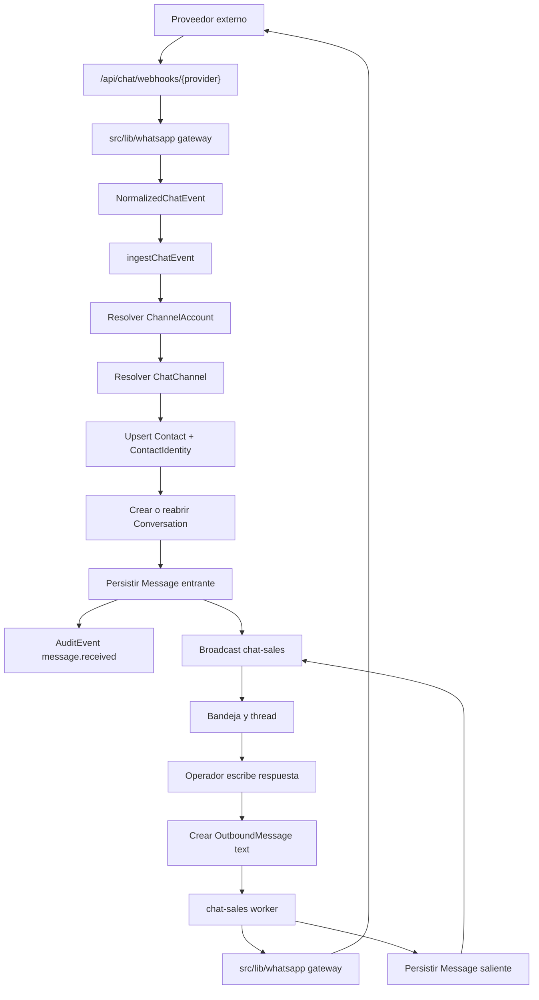
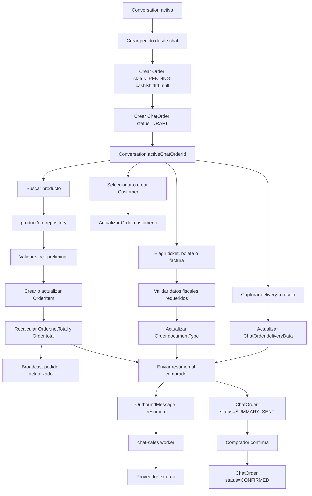
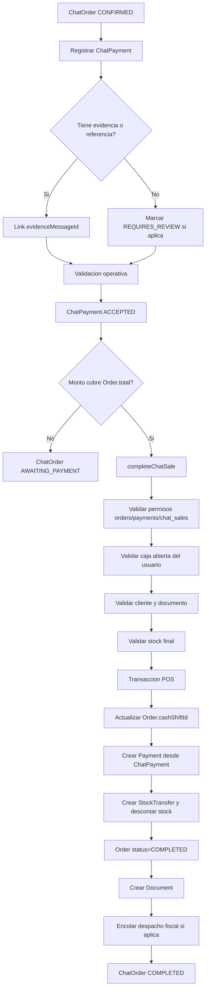
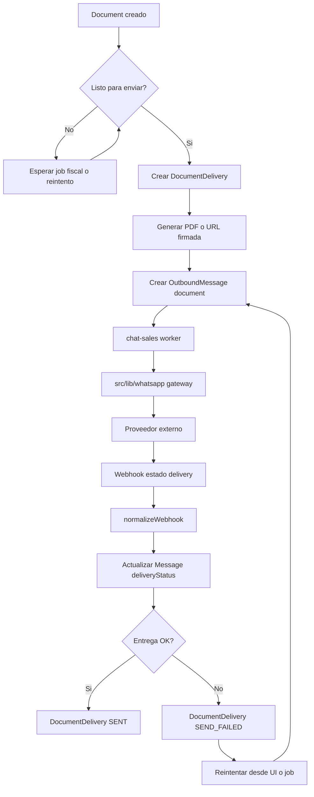

# Arquitectura: ventas por chat agnosticas a proveedor

Fecha: 2026-06-27

Documento base: `docs/2026-06-27-whatsapp-sales-spec.md`

## Resumen

La iniciativa debe implementarse como ventas asistidas por chat, no como un
modulo acoplado a WhatsApp. WhatsApp sera el primer proveedor de mensajeria, pero
la logica de negocio debe operar sobre conversaciones, mensajes, contactos,
borradores de venta, pagos y entregas de comprobante sin depender de conceptos
externos como `wa_id`, `phone_number_id`, WABA, templates de Meta o reglas
propias de WhatsApp.

Nombre tecnico recomendado: `chat-sales`.

Nombre visible recomendado: `Ventas por chat`.

## Decision arquitectonica

La arquitectura se divide en tres capas:

1. `src/chat-sales`: dominio y aplicacion de ventas por chat.
2. `src/lib/whatsapp`: cliente/gateway reutilizable para WhatsApp.
3. Composition roots: rutas API, actions y jobs que conectan casos de uso con
   implementaciones concretas.

La interfaz de comunicacion no vive en `src/lib`. Cada caso de uso de
`chat-sales` define el puerto que necesita. TypeScript hace el match estructural
con las funciones exportadas por `src/lib/whatsapp`.

Este criterio sigue el patron actual del repo. Por ejemplo,
`src/document/use_cases/create-document.ts` define `DocumentGateway`, mientras
`src/document/factpro/gateway.ts` exporta una implementacion compatible. El caso
de uso depende del contrato que necesita, no del proveedor.

## Limites de dominio

`chat-sales` posee:

- Canales de chat habilitados para ventas.
- Conversaciones, asignacion, estados, cierre y reapertura.
- Contactos e identidades externas por canal.
- Mensajes normalizados entrantes, salientes y de sistema.
- Pedido chat persistido como `Order PENDING` y orquestado por `ChatOrder`.
- Registro conversacional de pago antes de crear la venta POS.
- Outbox de mensajes a enviar o reintentar.
- Estado de entrega del comprobante por chat.
- Auditoria de acciones operativas.

`chat-sales` no posee:

- El protocolo de WhatsApp.
- Templates, webhooks o payloads de Meta.
- Catalogo, precios o stock fuente. Usa `Product`.
- Cliente maestro fiscal. Usa `Customer`.
- Caja. Usa `CashShift`.
- Venta final. Convierte a `Order`.
- Comprobante fiscal. Usa `Document`.

## Modulos propuestos

```text
src/chat-sales/
  types.ts
  schemas.ts
  db_repository.ts
  actions.ts
  api_repository.ts
  jobs.ts
  outbox.ts
  use-cases/
    ingest-chat-event.ts
    assign-conversation.ts
    send-conversation-message.ts
    create-chat-order.ts
    update-chat-order.ts
    confirm-chat-order.ts
    register-chat-payment.ts
    complete-chat-sale.ts
    deliver-document.ts
  components/
    conversation-inbox.tsx
    conversation-thread.tsx
    chat-order-panel.tsx
    channel-settings-form.tsx

src/lib/whatsapp/
  index.ts
  types.ts
  errors.ts
  meta-cloud-api/
    client.ts
    gateway.ts
    signature.ts
    webhook.ts
    normalizer.ts
    media.ts
    templates.ts
    types.ts
```

Rutas Next.js:

```text
src/app/api/chat/webhooks/[provider]/route.ts
src/app/[subdomain]/dashboard/chat-sales/page.tsx
src/app/[subdomain]/dashboard/chat-sales/layout.tsx
src/app/[subdomain]/dashboard/(dashboard)/settings/chat-sales/page.tsx
```

## Entidades agnosticas

| Entidad | Responsabilidad |
| --- | --- |
| `ChannelProvider` | Proveedor tecnico disponible: Meta WhatsApp Cloud, Telegram, Instagram, email, SMS. |
| `ChannelAccount` | Cuenta externa conectada: numero, bot, inbox, email o sender ID. |
| `ChatChannel` | Canal habilitado para una empresa y proposito, por ejemplo ventas. |
| `Contact` | Persona externa agnostica al canal, vinculable a `Customer`. |
| `ContactIdentity` | Identidad del contacto por canal/proveedor. |
| `Conversation` | Atencion operativa entre empresa y contacto. |
| `Message` | Mensaje normalizado entrante, saliente o de sistema. |
| `ChatOrder` | Estado conversacional de una `Order` armada desde el chat. |
| `Order` | Pedido POS reutilizado como carrito persistente en estado `PENDING`. |
| `OrderItem` | Items, cantidades, precios y totales del pedido. |
| `ChatPayment` | Registro/validacion de pago antes de cerrar venta. |
| `DocumentDelivery` | Intento de entrega de comprobante por un canal. |
| `OutboundMessage` | Outbox de mensajes a enviar o reintentar. |
| `AuditEvent` | Trazabilidad de toma, reasignacion, cobro, emision, reenvio y cierre. |

Separar `Contact` de `ContactIdentity` evita que el dominio asuma que todos los
canales se identifican por telefono. WhatsApp usa telefono/wa id, Telegram puede
usar chat id, email usa address y SMS usa telefono sin conversacion rica.

## ERD propuesto

```mermaid
erDiagram
  COMPANY {
    string id PK
    string subdomain
    boolean active
  }

  USER {
    string id PK
    string companyId FK
    string role
    boolean active
  }

  CHANNEL_PROVIDER {
    string id PK
    string kind
    json capabilities
  }

  CHANNEL_ACCOUNT {
    string id PK
    string companyId FK
    string providerId FK
    string externalAccountId
    string displayAddress
    string credentialsRef
    string webhookSecretRef
    boolean active
  }

  CHAT_CHANNEL {
    string id PK
    string companyId FK
    string channelAccountId FK
    string purpose
    boolean enabled
    json settings
  }

  CONTACT {
    string id PK
    string companyId FK
    string customerId FK
    string displayName
    string primaryIdentity
  }

  CONTACT_IDENTITY {
    string id PK
    string companyId FK
    string contactId FK
    string channelAccountId FK
    string providerKind
    string externalContactId
    string displayAddress
    json profile
  }

  CONVERSATION {
    string id PK
    string companyId FK
    string chatChannelId FK
    string contactId FK
    string assignedUserId FK
    string activeChatOrderId FK
    string status
    int unreadCount
    datetime lastMessageAt
    datetime resolvedAt
  }

  MESSAGE {
    string id PK
    string companyId FK
    string conversationId FK
    string outboundMessageId FK
    string direction
    string type
    string body
    string externalMessageId
    string deliveryStatus
    json media
    json rawPayload
    datetime createdAt
  }

  CHAT_ORDER {
    string id PK
    string companyId FK
    string conversationId FK
    string orderId FK
    string summaryMessageId FK
    string status
    json deliveryData
    datetime confirmedAt
    datetime abandonedAt
    datetime completedAt
  }

  ORDER {
    string id PK
    string companyId FK
    string customerId FK
    string cashShiftId FK
    string status
    string orderType
    string documentType
    decimal netTotal
    decimal discountAmount
    decimal total
  }

  ORDER_ITEM {
    string id PK
    string orderId FK
    string productId FK
    decimal quantity
    decimal productPrice
    string notes
    int round
    decimal netTotal
    decimal discountAmount
    decimal total
  }

  CHAT_PAYMENT {
    string id PK
    string companyId FK
    string chatOrderId FK
    string paymentId FK
    string evidenceMessageId FK
    string method
    decimal amount
    string reference
    string status
    string acceptedByUserId FK
    datetime acceptedAt
  }

  PAYMENT {
    string id PK
    string orderId FK
    string cashShiftId FK
    string method
    decimal amount
    json data
  }

  CASH_SHIFT {
    string id PK
    string userId FK
    string companyId FK
    string status
    datetime openedAt
  }

  DOCUMENT {
    string id PK
    string companyId FK
    string orderId FK
    string customerId FK
    string documentType
    string status
    boolean issuedToTaxEntity
  }

  DOCUMENT_DELIVERY {
    string id PK
    string companyId FK
    string conversationId FK
    string documentId FK
    string outboundMessageId FK
    string status
    int attempts
    string lastError
    datetime sentAt
  }

  OUTBOUND_MESSAGE {
    string id PK
    string companyId FK
    string conversationId FK
    string channelAccountId FK
    string kind
    string status
    string externalMessageId
    int attempts
    json payload
    string lastError
    datetime nextAttemptAt
  }

  AUDIT_EVENT {
    string id PK
    string companyId FK
    string conversationId FK
    string actorUserId FK
    string eventType
    json payload
    datetime createdAt
  }

  STOCK_TRANSFER {
    string id PK
    string companyId FK
    string productId FK
    string userId FK
    string type
    string status
    decimal value
    json data
  }

  CUSTOMER {
    string id PK
    string companyId FK
    string documentType
    string documentNumber
    string legalName
    string phoneNumber
  }

  PRODUCT {
    string id PK
    string companyId FK
    string name
    decimal price
    decimal stock
  }

  COMPANY ||--o{ CHANNEL_ACCOUNT : owns
  CHANNEL_PROVIDER ||--o{ CHANNEL_ACCOUNT : backs
  COMPANY ||--o{ CHAT_CHANNEL : owns
  CHANNEL_ACCOUNT ||--o{ CHAT_CHANNEL : enables
  COMPANY ||--o{ CONTACT : owns
  CUSTOMER ||--o{ CONTACT : may_link
  CONTACT ||--o{ CONTACT_IDENTITY : has
  CHANNEL_ACCOUNT ||--o{ CONTACT_IDENTITY : identifies
  CHAT_CHANNEL ||--o{ CONVERSATION : carries
  CONTACT ||--o{ CONVERSATION : starts
  USER ||--o{ CONVERSATION : attends
  CONVERSATION ||--o{ MESSAGE : contains
  CONVERSATION ||--o{ CHAT_ORDER : has_history
  CONVERSATION ||--o| CHAT_ORDER : has_active
  CHAT_ORDER ||--|| ORDER : wraps
  CUSTOMER ||--o{ ORDER : requested_by
  ORDER ||--o{ ORDER_ITEM : contains
  PRODUCT ||--o{ ORDER_ITEM : selected
  CHAT_ORDER ||--o{ CHAT_PAYMENT : records
  MESSAGE ||--o{ CHAT_PAYMENT : may_evidence
  CHAT_PAYMENT }o--o| PAYMENT : maps_to
  ORDER ||--o{ PAYMENT : has
  CASH_SHIFT ||--o{ ORDER : closes
  CASH_SHIFT ||--o{ PAYMENT : receives
  ORDER ||--o{ DOCUMENT : emits
  ORDER_ITEM ||--o{ STOCK_TRANSFER : moves_stock
  DOCUMENT ||--o{ DOCUMENT_DELIVERY : delivered_by
  CONVERSATION ||--o{ DOCUMENT_DELIVERY : receives
  OUTBOUND_MESSAGE ||--o| MESSAGE : creates_provider_message
  CONVERSATION ||--o{ OUTBOUND_MESSAGE : queues
  DOCUMENT_DELIVERY }o--o| OUTBOUND_MESSAGE : uses
  CONVERSATION ||--o{ AUDIT_EVENT : audits
  USER ||--o{ AUDIT_EVENT : performs
```



Relaciones clave:

- `Conversation` mantiene el historial y puede tener muchos `ChatOrder`, pero
  solo uno activo mediante `activeChatOrderId`.
- `ChatOrder` no duplica items ni totales. Orquesta el estado conversacional de
  una `Order` existente.
- `Order` se crea en estado `PENDING` cuando el operador inicia un pedido desde
  el chat o agrega el primer producto. En el schema actual no existe `DRAFT`;
  `PENDING` es el equivalente persistido que ya usa el flujo de mesas.
- Mientras `ChatOrder` no se completa, `Order.cashShiftId`, `Payment`,
  `Document` y `StockTransfer` no deben existir.
- `OrderItem` es la fuente de productos, cantidades, notas, precios y totales.
  Si se requiere historial estable ante cambios de producto, se deben agregar
  snapshots a `OrderItem`, no crear una tabla paralela de items para chat.
- `ChatPayment` registra evidencia y validacion conversacional. Cuando se acepta
  y se cierra la venta, se transforma en uno o mas `Payment` POS.
- `DocumentDelivery` no reemplaza a `Document`. Solo registra la entrega del
  comprobante por el canal de chat.
- `OutboundMessage` permite reintentos e idempotencia de envios. Puede terminar
  creando un `Message` saliente cuando el proveedor confirma el envio.

## Modelo de proveedor y cuenta externa

```text
ChannelProvider
  id: "meta-whatsapp-cloud"
  kind: "WHATSAPP"
  capabilities:
    text: true
    media: true
    documents: true
    templates: true
    deliveryReceipts: true
    readReceipts: true
    inboundMedia: true

ChannelAccount
  providerId: "meta-whatsapp-cloud"
  externalAccountId: "<phone_number_id>"
  displayAddress: "+51 999 999 999"
  credentialsRef: "secret://..."
  webhookSecretRef: "secret://..."

ChatChannel
  companyId
  channelAccountId
  purpose: "SALES"
  enabled
  settings:
    greeting
    businessHours
    quickReplies
    firstResponseSlaMinutes
    reopenWindowMinutes
```

Campos especificos de WhatsApp se guardan como datos de `ChannelAccount` o en
credenciales referenciadas. No se filtran a `Conversation`, `Message` ni
`ChatOrder` ni `Order`.

## Puertos definidos por casos de uso

Los puertos viven junto al caso de uso que los necesita. No existe
`src/lib/chat` como contrato global.

### Ingesta de eventos

```ts
// src/chat-sales/use-cases/ingest-chat-event.ts
import type { response } from "@/lib/types";
import type {
  ChatAccountRef,
  NormalizedChatEvent,
  RawChatWebhookRequest,
} from "@/chat-sales/types";

interface ChatEventGateway {
  verifyWebhook(
    request: RawChatWebhookRequest,
  ): Promise<response<void>>;

  extractAccountRef(
    request: RawChatWebhookRequest,
  ): Promise<response<ChatAccountRef>>;

  normalizeWebhook(
    request: RawChatWebhookRequest,
  ): Promise<response<NormalizedChatEvent[]>>;
}

interface Repository {
  findChannelByAccountRef(accountRef: ChatAccountRef): Promise<response<ChatChannel>>;
  ingestEvent(channel: ChatChannel, event: NormalizedChatEvent): Promise<response<void>>;
}

export async function ingestChatEvent(
  gateway: ChatEventGateway,
  repository: Repository,
  request: RawChatWebhookRequest,
): Promise<response<void>> {
  // caso de uso
}
```

### Envio de mensajes

```ts
// src/chat-sales/use-cases/send-conversation-message.ts
import type { response } from "@/lib/types";
import type {
  ChatChannelAccount,
  ChatSendResult,
  SendChatMediaMessage,
  SendChatTextMessage,
} from "@/chat-sales/types";

interface ChatMessageGateway {
  sendText(
    account: ChatChannelAccount,
    message: SendChatTextMessage,
  ): Promise<response<ChatSendResult>>;

  sendMedia(
    account: ChatChannelAccount,
    message: SendChatMediaMessage,
  ): Promise<response<ChatSendResult>>;
}

interface Repository {
  findOutboundMessage(id: string): Promise<response<OutboundMessage>>;
  markOutboundSent(id: string, result: ChatSendResult): Promise<response<void>>;
  markOutboundFailed(id: string, error: string): Promise<response<void>>;
}

export async function sendConversationMessage(
  gateway: ChatMessageGateway,
  repository: Repository,
  outboundMessageId: string,
): Promise<response<void>> {
  // caso de uso
}
```

### Entrega de comprobantes

```ts
// src/chat-sales/use-cases/deliver-document.ts
import type { response } from "@/lib/types";
import type {
  ChatChannelAccount,
  ChatSendResult,
  SendChatDocumentMessage,
} from "@/chat-sales/types";

interface ChatDocumentGateway {
  sendDocument(
    account: ChatChannelAccount,
    message: SendChatDocumentMessage,
  ): Promise<response<ChatSendResult>>;
}

interface Repository {
  findPendingDocumentDelivery(id: string): Promise<response<DocumentDelivery>>;
  markDocumentDeliverySent(id: string, result: ChatSendResult): Promise<response<void>>;
  markDocumentDeliveryFailed(id: string, error: string): Promise<response<void>>;
}

export async function deliverDocument(
  gateway: ChatDocumentGateway,
  repository: Repository,
  deliveryId: string,
): Promise<response<void>> {
  // caso de uso
}
```

## Adapter WhatsApp

`src/lib/whatsapp` es un modulo reutilizable de infraestructura. No importa
interfaces de `chat-sales`. Exporta funciones y objetos que hacen match
estructural con los puertos de los casos de uso.

```ts
// src/lib/whatsapp/meta-cloud-api/gateway.ts
export function metaWhatsAppGateway(config: MetaWhatsAppConfig) {
  return {
    verifyWebhook,
    extractAccountRef,
    normalizeWebhook,
    sendText,
    sendMedia,
    sendDocument,
    sendTemplate,
    downloadMedia,
  };
}
```

Responsabilidades:

- `client.ts`: llamadas HTTP a Meta Cloud API.
- `signature.ts`: validacion de firma y challenge.
- `webhook.ts`: parseo de payloads crudos.
- `normalizer.ts`: conversion de payloads WhatsApp a eventos normalizados.
- `media.ts`: descarga de media/documentos.
- `templates.ts`: envio de plantillas aprobadas.
- `gateway.ts`: fachada que agrupa funciones compatibles con puertos de uso.
- `types.ts`: tipos especificos de Meta/WhatsApp.

Este modulo puede reutilizarse para ventas por chat, notificaciones,
recordatorios u otros flujos que necesiten enviar mensajes por WhatsApp.

## Composition roots

Los puntos de entrada importan el caso de uso y el adapter concreto.

```ts
// src/app/api/chat/webhooks/[provider]/route.ts
import { ingestChatEvent } from "@/chat-sales/use-cases/ingest-chat-event";
import * as repository from "@/chat-sales/db_repository";
import { metaWhatsAppGateway } from "@/lib/whatsapp/meta-cloud-api/gateway";

export async function POST(request: Request) {
  const gateway = metaWhatsAppGateway(/* config */);
  return ingestChatEvent(gateway, repository, request);
}
```

```ts
// src/chat-sales/jobs.ts
import { sendConversationMessage } from "@/chat-sales/use-cases/send-conversation-message";
import * as repository from "@/chat-sales/db_repository";
import { metaWhatsAppGateway } from "@/lib/whatsapp/meta-cloud-api/gateway";

// El job resuelve el provider de ChannelAccount y construye el adapter adecuado.
```

El dominio se mantiene desacoplado porque `use-cases` no importan
`@/lib/whatsapp`.

## Flujos operativos agrupados

Los flujos se agrupan por dependencia. Una conversacion puede operar sin pedido;
un pedido puede armarse sin caja; el cierre POS requiere pago aceptado, caja,
stock final y datos fiscales completos.

### 1. Conversacion y mensajes

Este flujo cubre mensaje entrante, mensaje normal de respuesta y actualizacion de
estado en la bandeja. No crea `Order`.



### 2. Armado y confirmacion del pedido

Este flujo empieza cuando el operador decide vender desde el chat. Crea
`ChatOrder` y una `Order PENDING` sin caja, pagos, documento ni stock transfer.
Los productos se guardan como `OrderItem`.



### 3. Pago conversacional y cierre POS

El pago conversacional no es `Payment` POS hasta completar la venta. Al cierre se
valida permiso, caja abierta, pago total, datos fiscales y stock final. Recien
ahi se setea `cashShiftId`, se crean `Payment`, `StockTransfer` y `Document`.



### 4. Comprobante y reintentos por chat

Este flujo depende de una `Order COMPLETED` y un `Document`. Para ticket puede
enviarse apenas se genera. Para boleta/factura, la recomendacion es esperar que
el comprobante este listo segun el flujo fiscal.



## Integracion con modulos existentes

- `product`: busqueda, precios y stock preliminar.
- `customer`: vinculacion o creacion de cliente.
- `cash-shift`: validacion de caja abierta solo al cobrar.
- `order`: carrito persistente en `PENDING` y cierre final como `COMPLETED`.
- `stock-transfer`: descuento real de stock al cerrar venta.
- `document`: generacion y despacho fiscal.
- `lib/realtime`: eventos de bandeja y conversacion por empresa.
- `lib/queue`: outbox y jobs de envio/reintento.
- `authorization`: nuevo recurso `chat_sales`.
- `feature-flags`: nuevo flag `chatSales`.

La venta final debe extraerse desde `src/order/actions.ts` hacia un use case
compartido para que `chat-sales` pueda cerrar ventas sin depender de una server
action pensada para UI.

En el modelo actual `OrderStatus` no tiene `DRAFT`; los estados persistidos son
`PENDING`, `COMPLETED` y `CANCELLED`. Para ventas por chat se reutiliza
`Order PENDING` como pedido en armado, igual que el flujo de mesas crea una
orden pendiente al abrir una sesion. El estado fino del flujo conversacional vive
en `ChatOrder`.

## Estados recomendados

Conversacion:

- `UNASSIGNED`
- `ASSIGNED`
- `WAITING_CONTACT`
- `HAS_ACTIVE_ORDER`
- `RESOLVED`
- `REOPENED`
- `NEEDS_REVIEW`

ChatOrder:

- `DRAFT`
- `SUMMARY_SENT`
- `CONFIRMED`
- `AWAITING_PAYMENT`
- `PAID`
- `COMPLETING`
- `COMPLETED`
- `ABANDONED`
- `CANCELLED`

Order:

- `PENDING`: pedido en armado o confirmado, sin caja, pagos POS, documento ni
  stock transfer.
- `COMPLETED`: venta cerrada en POS, con caja, pago, stock y documento.
- `CANCELLED`: venta POS cancelada. No usar para pedidos chat abandonados sin
  cierre fiscal; para eso usar `ChatOrder.ABANDONED` o `ChatOrder.CANCELLED`.

Pago conversacional:

- `PENDING`
- `REQUIRES_REVIEW`
- `PARTIAL`
- `ACCEPTED`
- `REJECTED`
- `REFUNDED`

Delivery de comprobante:

- `NOT_REQUESTED`
- `MISSING_DATA`
- `GENERATING`
- `ISSUED`
- `SENDING`
- `SENT`
- `SEND_FAILED`
- `CANCELLED`

## Archivos principales a tocar

1. `prisma/schema.prisma`: modelos agnosticos de chat.
2. `src/chat-sales/*`: dominio, casos de uso, actions, jobs, componentes.
3. `src/lib/whatsapp/*`: adapter inicial de WhatsApp.
4. `src/app/api/chat/webhooks/[provider]/route.ts`: webhook agnostico.
5. `src/app/[subdomain]/dashboard/chat-sales/*`: consola operativa.
6. `src/app/[subdomain]/dashboard/(dashboard)/settings/chat-sales/page.tsx`.
7. `src/authorization/types.ts` y `src/authorization/permissions.ts`.
8. `src/proxy.ts`.
9. `src/constants/data.ts`.
10. `src/feature-flags/registry.ts`.
11. `src/worker.ts`: registrar jobs de `chat-sales`.

## Riesgos y decisiones pendientes

- Evitar que nombres de WhatsApp entren al dominio.
- Definir donde guardar credenciales: env, JSON cifrado, secret manager o
  referencia externa.
- Decidir si `ChannelProvider` sera tabla, enum o registry en codigo.
- Definir soporte MVP para media entrante, constancias de pago y documentos.
- Establecer politica de reapertura por canal.
- Definir retencion de mensajes, media, telefonos y comprobantes.
- Resolver generacion de PDF o URL firmada para enviar comprobantes fuera de una
  sesion de usuario.
- Endurecer creacion de `Order`: actualmente `order/db_repository.create`
  filtra items fallidos en vez de fallar toda la venta.
- Endurecer stock: la validacion final existe, pero el decremento no usa una
  condicion atomica `stock >= cantidad`.
- Implementar idempotencia fuerte por `provider + externalAccountId +
  externalEventId`.

## Criterio de exito

La primera implementacion puede usar solo WhatsApp, pero el dominio debe poder
integrar otro proveedor creando un adapter nuevo y conectandolo en los puntos de
entrada, sin modificar los casos de uso centrales de ventas por chat.
