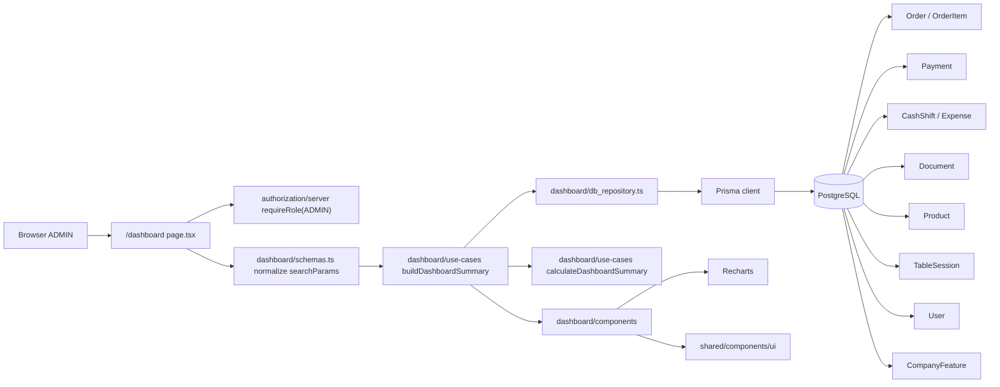
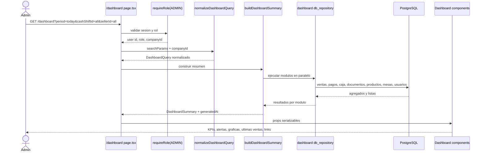
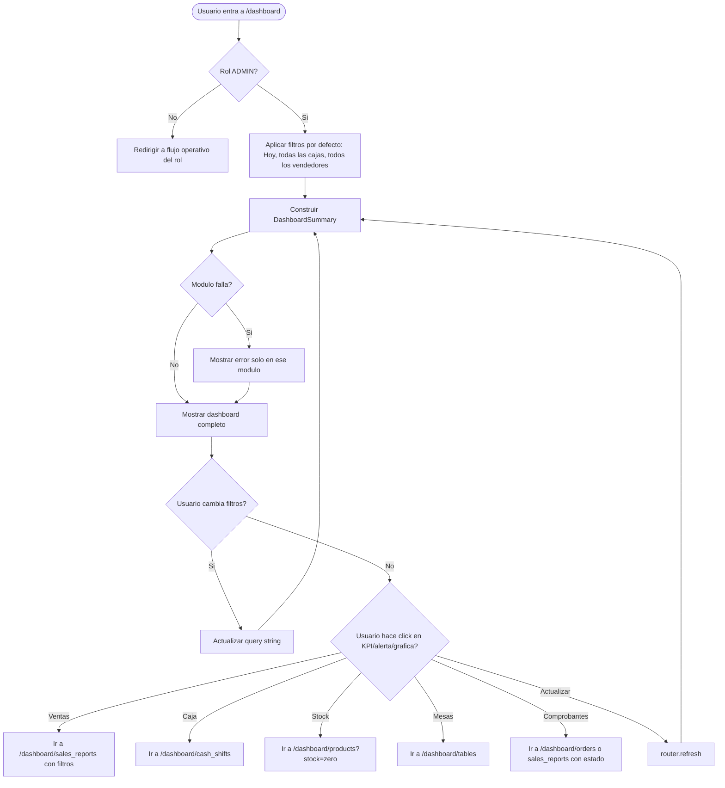

# Solucion tecnica: Dashboard operativo V1

## Documento base

Este documento aterriza tecnicamente el alcance definido en
`docs/product-dashboard.md`.

La decision de producto es reemplazar el dashboard generico actual por una vista
operativa para `ADMIN`, con foco en ventas cobradas, caja, alertas, productos,
actividad reciente y accesos a detalle.

## Resumen ejecutivo

La solucion requiere una nueva feature de lectura agregada: `src/dashboard`.
Esta feature no representa una nueva entidad del negocio ni requiere una tabla
propia. Su responsabilidad es componer read models operativos a partir de datos
existentes:

- `Order` y `OrderItem` para ventas, anulaciones, descuentos, productos y
  ultimas ventas.
- `Payment` para desglose por medio de pago.
- `CashShift` y `Expense` para estado de caja y efectivo esperado.
- `Document` para etiquetas de comprobante en ultimas ventas.
- `Product` para stock en cero.
- `TableSession` y `CompanyFeature` para mesas activas cuando restaurantes esta
  habilitado.
- `User` para filtro de vendedor.

No se debe meter logica de metricas en componentes, rutas o repositorios de otras
features. La pagina `/dashboard` queda como capa de entrega y `src/dashboard`
concentra normalizacion, queries, read models y componentes propios.

## Estado actual relevante

### Ya existe

- Ruta actual: `src/app/[subdomain]/dashboard/(dashboard)/page.tsx`.
- La pagina actual usa una plantilla generica con datos mock en
  `src/shared/overview.tsx` y `src/shared/recent-sales.tsx`.
- `recharts` ya esta instalado y puede usarse para graficas.
- Roles existentes: `ADMIN`, `CASHIER`, `SELLER`, `WAITER`, `KITCHEN`,
  `BARTENDER`.
- `src/proxy.ts` ya protege `/dashboard` y redirige roles sin permiso.
- `src/constants/data.ts` ya define la navegacion principal.
- Feature flags existentes incluyen `restaurants`.
- `TableSession` ya permite contar mesas activas con `status` y `current`.
- `Order.sellerId` ya permite filtrar por vendedor.
- `Document.SearchParams` ya tiene campos tecnicos para `sellerId`,
  `sellerMode` y `orderStatus`, aunque la pagina/filtros actuales no los usan
  completamente.

### Gaps

- El dashboard actual no consulta datos reales.
- No existe `src/dashboard`.
- No existe un read model agregado para KPIs, alertas y graficas.
- No hay filtro de stock cero en productos.
- No hay filtros de reporte para producto, medio de pago o descuentos.
- No hay ruta KDS implementada en `src/app` para `KITCHEN` y `BARTENDER`,
  aunque esta documentada en planes de restaurante.
- `Order` no tiene `cancelledAt`; por eso "anulaciones del periodo" no es
  exacto si se calcula solo con `createdAt` o `updatedAt`.
- El concepto "Caja" en V1 debe mapearse a `CashShift`; no existe una entidad
  persistida de caja fisica/caja registradora.

## Decision: nueva feature o nueva entidad

| Pregunta | Decision |
| --- | --- |
| Nueva feature | Si: `src/dashboard` |
| Nueva entidad persistida | No para V1 |
| Nueva tabla | No |
| Migracion obligatoria | Solo si se decide medir anulaciones por fecha real con `cancelledAt` |
| Migraciones recomendadas | Indices para consultas agregadas del dashboard |

`src/dashboard` es una feature porque el dashboard tiene lenguaje, reglas,
filtros, read models y flujos propios. No es una extension natural de
`sale_report`, `order` o `cash-shift`; consume esas features, pero no debe quedar
acoplado a su UI.

## Arquitectura propuesta

```text
src/dashboard/
  types.ts
  schemas.ts
  db_repository.ts
  use-cases/
    normalize-dashboard-query.ts
    build-dashboard-summary.ts
    calculate-dashboard-summary.ts
  components/
    dashboard-page-content.tsx
    dashboard-header.tsx
    dashboard-filters.tsx
    kpi-summary.tsx
    operational-alerts.tsx
    sales-trend-chart.tsx
    payment-method-chart.tsx
    top-products-chart.tsx
    recent-sales-list.tsx
    quick-actions.tsx
    module-error-state.tsx
    empty-state.tsx
```

### Responsabilidades

| Archivo | Responsabilidad |
| --- | --- |
| `types.ts` | Tipos de query, KPIs, alertas, series, rankings y respuesta del dashboard |
| `schemas.ts` | Zod para parsear `searchParams` de periodo, caja, vendedor y fechas custom |
| `db_repository.ts` | Consultas Prisma y SQL agregadas, siempre filtradas por `companyId` |
| `normalize-dashboard-query.ts` | Convierte input externo en rango de fechas, bucket y filtros internos |
| `build-dashboard-summary.ts` | Orquesta repositorios, maneja errores parciales y compone la respuesta |
| `calculate-dashboard-summary.ts` | Calculos puros cuando la data venga como facts en memoria |
| `components/*` | Presentacion del dashboard; sin reglas de negocio ni consultas Prisma |

La ruta `src/app/[subdomain]/dashboard/(dashboard)/page.tsx` debe quedar como
adaptador:

1. Lee `searchParams`.
2. Valida rol con `requireRole("ADMIN")`.
3. Usa `session.user.companyId` como fuente confiable de tenant.
4. Llama al caso de uso `buildDashboardSummary`.
5. Renderiza `DashboardPageContent`.

## Diagrama de arquitectura



## Flujo de data



## Flujo de casos de uso V1



## Query del dashboard

La URL no debe aceptar `companyId`. El tenant se toma siempre de la sesion.

Parametros propuestos:

| Parametro | Valores | Default | Uso |
| --- | --- | --- | --- |
| `period` | `today`, `yesterday`, `last_7_days`, `this_month`, `custom` | `today` | Define rango |
| `start` | ISO date | Solo custom | Fecha inicial |
| `end` | ISO date | Solo custom | Fecha final |
| `cashShiftId` | `all` o id | `all` | Filtro de caja/turno |
| `sellerId` | `all` o id | `all` | Filtro de vendedor |

Tipo interno:

```ts
export type DashboardQuery = {
  companyId: string;
  period: "today" | "yesterday" | "last_7_days" | "this_month" | "custom";
  startDate: Date;
  endDate: Date;
  bucket: "hour" | "day";
  cashShiftId?: string;
  sellerId?: string;
  timezone: string;
};
```

Reglas:

- `period=today` y `period=yesterday` agrupan por hora.
- `period=last_7_days`, `this_month` y `custom` agrupan por dia.
- Las fechas visibles deben calcularse en zona horaria de negocio. Mientras no
  exista `Company.timezone`, usar `America/Lima`.
- Los filtros se aplican en todos los modulos donde tengan sentido.
- `cashShiftId=all` significa todas las cajas/turnos del rango.
- `sellerId=all` no filtra vendedor.

## Read model de respuesta

```ts
export type DashboardSummary = {
  query: DashboardQuery;
  generatedAt: Date;
  filters: {
    cashShifts: DashboardCashShiftOption[];
    sellers: DashboardSellerOption[];
  };
  modules: {
    kpis: DashboardModule<DashboardKpis>;
    alerts: DashboardModule<OperationalAlerts>;
    salesTrend: DashboardModule<SalesTrendPoint[]>;
    paymentBreakdown: DashboardModule<PaymentMethodBreakdown[]>;
    topProductsByAmount: DashboardModule<TopProductRow[]>;
    topProductsByQuantity: DashboardModule<TopProductRow[]>;
    recentSales: DashboardModule<RecentSaleRow[]>;
    quickActions: DashboardModule<QuickAction[]>;
  };
};

export type DashboardModule<T> =
  | { status: "ready"; data: T }
  | { status: "error"; message: string };
```

Esta estructura permite error parcial: si falla el modulo de comprobantes, el
dashboard sigue mostrando ventas, caja y productos.

## Definiciones tecnicas de KPIs

| KPI | Fuente | Regla |
| --- | --- | --- |
| Ventas cobradas | `Order` | `status = COMPLETED`, rango por `Order.createdAt`, suma `Order.total` |
| Numero de ventas cobradas | `Order` | Conteo de ordenes `COMPLETED` |
| Ticket promedio | Calculo | `ventasCobradas / numeroVentas`, cero si no hay ventas |
| Estado de caja | `CashShift`, `Payment`, `Expense` | Abierta/cerrada; efectivo esperado o diferencia |
| Ventas por hora/dia | `Order` | `COMPLETED`, agrupado por bucket |
| Ventas por medio de pago | `Payment` + `Order` | Suma `Payment.amount` por `method`, solo ordenes `COMPLETED` |
| Productos top por monto | `OrderItem` + `Order` + `Product` | Suma `OrderItem.total`, solo ordenes `COMPLETED` |
| Productos top por cantidad | `OrderItem` + `Order` + `Product` | Suma `OrderItem.quantity`, solo ordenes `COMPLETED` |
| Stock en cero | `Product` | `companyId`, `hidden = false`, `productType = SINGLE_PRODUCT`, `stock = 0` |
| Anulaciones | `Order` | `status = CANCELLED`; recomendado filtrar por `cancelledAt` |
| Descuentos | `Order`, `OrderItem` | Ordenes con `Order.discountAmount > 0` o items con `OrderItem.discountAmount > 0` |
| Ultimas ventas | `Order` + `Document` + `Payment` + `User` | Ordenes recientes del rango, con estado y datos operativos |

### Formula de caja

Para caja abierta:

```text
efectivoEsperado = initialAmount + pagosEnEfectivoCompletados - gastos
```

Para caja cerrada:

```text
diferencia = finalAmount - efectivoEsperado
```

No usar `CashShift.amountInCashRegister` actual si suma ventas de todos los
medios de pago. El dashboard debe mostrar efectivo esperado, no venta total.

## Consultas del repositorio

`dashboard/db_repository.ts` debe exponer funciones de lectura orientadas al
dashboard. Los nombres exactos pueden ajustarse en implementacion, pero la
separacion recomendada es:

```ts
export type DashboardRepository = {
  findKpiSalesSummary(query: DashboardQuery): Promise<response<SalesKpis>>;
  findCashShiftSummary(query: DashboardQuery): Promise<response<CashShiftSummary>>;
  findOperationalAlerts(query: DashboardQuery): Promise<response<OperationalAlerts>>;
  findSalesTrend(query: DashboardQuery): Promise<response<SalesTrendPoint[]>>;
  findPaymentBreakdown(query: DashboardQuery): Promise<response<PaymentMethodBreakdown[]>>;
  findTopProductsByAmount(query: DashboardQuery): Promise<response<TopProductRow[]>>;
  findTopProductsByQuantity(query: DashboardQuery): Promise<response<TopProductRow[]>>;
  findRecentSales(query: DashboardQuery): Promise<response<RecentSaleRow[]>>;
  findCashShiftOptions(query: DashboardQuery): Promise<response<DashboardCashShiftOption[]>>;
  findSellerOptions(companyId: string): Promise<response<DashboardSellerOption[]>>;
};
```

Las consultas agregadas con bucket por hora/dia pueden usar `prisma.$queryRaw`
con `Prisma.sql`, interpolacion parametrizada y filtros construidos de forma
segura. No usar concatenacion manual de SQL.

## Cambios por archivo

### Crear

| Archivo | Cambio |
| --- | --- |
| `src/dashboard/types.ts` | Definir read models del dashboard |
| `src/dashboard/schemas.ts` | Zod para filtros de URL |
| `src/dashboard/db_repository.ts` | Consultas agregadas y mappers |
| `src/dashboard/use-cases/normalize-dashboard-query.ts` | Normalizar periodo, fechas y filtros |
| `src/dashboard/use-cases/build-dashboard-summary.ts` | Orquestar modulos y manejar errores parciales |
| `src/dashboard/use-cases/calculate-dashboard-summary.ts` | Calculos puros testeables |
| `src/dashboard/components/*` | UI del dashboard operativo |
| `src/dashboard/__TEST__/*` | Tests unitarios de normalizacion y calculos |

### Modificar

| Archivo | Cambio |
| --- | --- |
| `src/app/[subdomain]/dashboard/(dashboard)/page.tsx` | Reemplazar mock dashboard por `DashboardPageContent` y data real |
| `src/constants/data.ts` | Agregar item `Dashboard` visible para `ADMIN` con permiso `reports:read` |
| `src/proxy.ts` | Completar redirecciones por rol: `ADMIN -> /dashboard`, `CASHIER/SELLER -> /dashboard/orders/new`, `WAITER -> /dashboard/tables` si restaurantes, `KITCHEN/BARTENDER -> KDS` cuando exista ruta |
| `src/app/[subdomain]/dashboard/(dashboard)/sales_reports/page.tsx` | Leer query params adicionales para links desde dashboard |
| `src/sale_report/components/filter/*` | Agregar filtros UI si se decide que los links deban ser visibles/editables |
| `src/product/db_repository.ts` | Soportar filtro `stock=zero` o funcion especifica para productos sin stock |
| `src/app/[subdomain]/dashboard/(dashboard)/products/page.tsx` | Interpretar `stock=zero` para destino desde alerta |

### Opcional pero recomendado

| Archivo | Cambio |
| --- | --- |
| `prisma/schema.prisma` | Agregar `Order.cancelledAt DateTime?` para anulaciones reales por periodo |
| `src/order/use-cases/cancel.ts` | Setear `cancelledAt = now` cuando se anula una venta |
| `src/order/db_repository.ts` | Persistir `cancelledAt` en update de anulacion |

## Cambios de Prisma recomendados

No se requiere una nueva tabla. Para exactitud y performance se recomiendan estos
cambios:

```prisma
model Order {
  cancelledAt DateTime?

  @@index([companyId, status, createdAt])
  @@index([companyId, cashShiftId, status, createdAt])
  @@index([companyId, sellerId, status, createdAt])
  @@index([companyId, status, cancelledAt])
}

model OrderItem {
  @@index([orderId])
  @@index([productId])
}

model Payment {
  @@index([cashShiftId, method])
  @@index([orderId, method])
}

model Product {
  @@index([companyId, hidden, stock])
}

model Document {
  @@index([companyId, status, dateOfIssue])
}

```

Si se evita la migracion de `cancelledAt`, el dashboard puede usar
`Order.updatedAt` como aproximacion temporal de anulacion, pero esa lectura no es
contablemente precisa.

## Dependencias

### Internas

| Dependencia | Uso |
| --- | --- |
| `authorization/server` | `requireRole("ADMIN")` en la ruta |
| `feature-flags` | Determinar si mostrar mesas activas o pedidos abiertos |
| `order` | Estados, descuentos, ventas cobradas y anulaciones |
| `cash-shift` | Estado de caja, efectivo esperado y diferencias |
| `document` | Etiquetas de comprobante en ultimas ventas |
| `product` | Stock cero y ranking de productos |
| `table` | Mesas activas para restaurantes |
| `sale_report` | Destinos de detalle y filtros de reporte |
| `shared/components/ui` | Cards, botones, selects, skeletons, estados |

### Externas

No se requiere agregar dependencias nuevas.

Ya existen:

- `recharts` para graficas.
- `date-fns` y `date-fns-tz` para rangos de fecha y zona horaria.
- `zod` para validacion de filtros.
- `lucide-react` para iconos.

## Navegacion y destinos

| Elemento | Destino | Cambio requerido |
| --- | --- | --- |
| Nueva venta | `/dashboard/orders/new` | Ya existe |
| Ventas cobradas | `/dashboard/sales_reports?start=&end=&orderStatus=paid` | Parsear `orderStatus` en page/filtros |
| Estado de caja | `/dashboard/cash_shifts` o detalle de caja | Ya existe listado; detalle depende de UX |
| Stock en cero | `/dashboard/products?stock=zero` | Agregar soporte |
| Mesas activas | `/dashboard/tables` | Ya existe y depende de `restaurants` |
| Pedidos abiertos | `/dashboard/orders?status=pending` | Falta filtro visible/soportado |
| Anulaciones | `/dashboard/sales_reports?orderStatus=cancelled` | Parsear `orderStatus` |
| Descuentos | `/dashboard/sales_reports?hasDiscount=true` | Falta soporte |
| Producto top | `/dashboard/sales_reports?productId=<id>` | Falta soporte |
| Medio de pago | `/dashboard/sales_reports?paymentMethod=<method>` | Falta soporte |

## Reglas de roles

El dashboard V1 solo renderiza para `ADMIN`.

Redirecciones esperadas:

| Rol | Ruta destino |
| --- | --- |
| `ADMIN` | `/dashboard` |
| `CASHIER` | `/dashboard/orders/new` |
| `SELLER` | `/dashboard/orders/new` |
| `WAITER` | `/dashboard/tables` si restaurantes esta habilitado; fallback temporal `/dashboard/orders/new` |
| `KITCHEN` | `/dashboard/kitchen/kds` cuando exista KDS |
| `BARTENDER` | `/dashboard/kitchen/kds?station=bar` cuando exista KDS |

Nota: hoy no hay ruta KDS en `src/app`. Si no se implementa junto con este
dashboard, `KITCHEN` y `BARTENDER` deben seguir redirigiendo a `/login` o a un
fallback explicitamente definido hasta que exista su flujo operativo.

## Estados de UI

| Estado | Regla |
| --- | --- |
| Carga | Usar skeletons por modulo, preservando la estructura |
| Sin ventas | Mostrar "Aun no hay ventas en este periodo." y acciones de nueva venta/cambiar periodo |
| Sin stock cero | No mostrar alerta roja; mostrar estado neutro si el modulo esta visible |
| Error parcial | Mostrar `ModuleErrorState` solo en el modulo fallido |
| Error de autorizacion | Redirigir fuera de `/dashboard` segun rol |

## Seguridad y tenant isolation

- Nunca aceptar `companyId` desde query string.
- Todas las consultas deben filtrar por `companyId`.
- `cashShiftId`, `sellerId`, `productId` y `orderId` deben validarse dentro del
  tenant antes de usarse como filtro o destino.
- La pagina debe usar `requireRole("ADMIN")`, no solo permisos de reporte.
- Los links de detalle no conceden acceso por si mismos; las rutas destino deben
  mantener sus guards actuales.

## Performance

El dashboard concentra varias consultas agregadas. Para V1:

- Ejecutar modulos en paralelo con `Promise.allSettled`.
- Limitar rankings a top 10.
- Limitar ultimas ventas a 8 o 10 filas.
- Usar queries agregadas en DB para graficas y rankings.
- Evitar traer todas las ordenes del periodo cuando el periodo pueda ser amplio.
- Mantener `dynamic = "force-dynamic"` en la pagina porque es una vista
  operativa.
- No usar cache global por tenant sin invalidacion clara; el boton "Actualizar"
  puede usar `router.refresh()`.

## Plan de implementacion recomendado

1. Crear `src/dashboard` con tipos, schemas, use-cases y repositorio.
2. Implementar tests de `normalizeDashboardQuery` y formulas de KPIs/caja.
3. Implementar consultas agregadas con datos reales.
4. Reemplazar la pagina actual de `/dashboard`.
5. Agregar item de navegacion "Dashboard".
6. Agregar destinos minimos: ventas, caja, productos stock cero, mesas.
7. Extender filtros de reportes para `orderStatus`, `sellerId`, `paymentMethod`,
   `productId` y `hasDiscount` segun prioridad.
8. Decidir y aplicar migracion `cancelledAt` si anulaciones del periodo deben ser
   exactas.
9. Agregar indices de performance.
10. Validar con `npm test`, `npm run lint` y `npm run build:dev`.

## Pruebas

### Unitarias

- `normalize-dashboard-query.test.ts`
  - defaults de periodo.
  - rangos para hoy, ayer, ultimos 7 dias, este mes y custom.
  - bucket por hora/dia.
  - rechazo de rango custom invalido.

- `calculate-dashboard-summary.test.ts`
  - ventas cobradas excluyen anuladas y pendientes.
  - ticket promedio en cero cuando no hay ventas.
  - efectivo esperado usa solo pagos cash y resta gastos.
  - descuentos suman orden e items.
  - anulaciones no inflan ventas.

### Integracion o repositorio

- Query de ventas por hora/dia con `Order.status = COMPLETED`.
- Query de medios de pago con pagos de ordenes completadas.
- Query de top productos por monto y cantidad.
- Query de stock cero excluye servicios y productos ocultos.
- Query de mesas activas solo si `restaurants` esta habilitado.

### QA manual

- `ADMIN` ve dashboard real.
- `CASHIER` y `SELLER` no ven dashboard y entran a nueva venta.
- `WAITER` no ve dashboard y entra a mesas o fallback operativo.
- Filtros recargan datos sin cambiar tenant.
- Clicks abren rutas destino con filtros.
- Estados vacios y errores parciales no rompen toda la pagina.

## Riesgos y decisiones pendientes

| Riesgo | Decision recomendada |
| --- | --- |
| Anulaciones sin fecha real | Agregar `Order.cancelledAt`; si no, documentar aproximacion con `updatedAt` |
| Caja fisica vs turno | En V1 "Caja" significa `CashShift`; crear entidad caja fisica queda fuera |
| Reporte de ventas aun document-based | Extender filtros actuales o migrar progresivamente a read model basado en `Order` |
| KDS no existe | No prometer redireccion final para `KITCHEN/BARTENDER` hasta implementar ruta |
| Producto renombrado | Rankings usan nombre actual de `Product`; snapshot historico queda fuera de V1 |
| Periodos por timezone | Usar `America/Lima` hasta que `Company` tenga timezone |

## Criterios tecnicos de aceptacion

- `/dashboard` ya no muestra datos mock.
- Solo `ADMIN` renderiza el dashboard.
- Las ventas cobradas se calculan desde `Order.status = COMPLETED`.
- Pedidos abiertos y mesas activas no se suman a ventas cobradas.
- El estado de caja usa efectivo esperado real.
- Las graficas usan datos agregados reales.
- Productos top y stock cero respetan `companyId`.
- Cada modulo puede fallar sin bloquear toda la pantalla.
- No se crea una nueva tabla de dashboard.
- El codigo nuevo queda en `src/dashboard` y respeta la separacion feature /
  use-case / repository / components.
