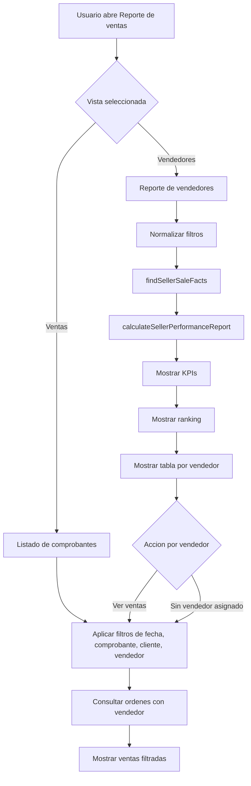
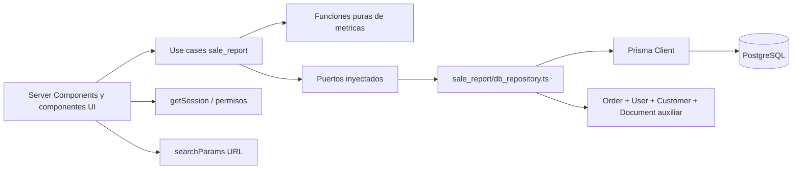

# Diseno tecnico: Performance de Vendedores

## Documento base

Este diseno tecnico evalua y aterriza el alcance definido en
`docs/plans/2026-06-28-seller-performance-product-design.md`.

La decision de producto es que la performance de vendedores vive en reportes.
La arquitectura debe mantener esa separacion: no convertir configuracion de
usuarios en un dashboard comercial y no meter logica de metricas dentro de
componentes o repositorios Prisma.

## Evaluacion del estado actual

### Lo que ya existe

- `User` ya modela sellers mediante `role = SELLER`, `sellerCode` y `active`.
- `Order` ya tiene `sellerId` y la relacion `seller User? @relation("SellerOrders")`.
- `Order` ya contiene los datos base de la venta: `companyId`, `customerId`,
  `total`, `status`, `documentType`, `createdAt` y pagos.
- `Order` ya tiene el indice `@@index([companyId, sellerId])`.
- `User` ya tiene `@@unique([companyId, sellerCode])` e indices por `companyId`,
  `role` y `active`.
- El flujo de pago ya resuelve el seller por codigo y persiste `sellerId` en la
  orden.
- `sales_reports/page.tsx` ya lista comprobantes usando `document/db_repository`.

### Gaps tecnicos

- El reporte de ventas actual esta orientado a `Document`. Para performance de
  vendedores debe migrar a un read model basado en `Order`.
- El reporte debe usar `Order.createdAt` como fecha de venta. No debe depender de
  `Document.dateOfIssue` para el rango de performance.
- El listado actual no trae `Order.seller`, por lo que falta un read model que
  incluya vendedor y cliente sin acoplar la UI a Prisma.

## Objetivo tecnico

Crear read models y casos de uso para responder:

- Cuanto vendio cada vendedor en un periodo.
- Cuantas ventas hizo cada vendedor.
- Cual es el ticket promedio y participacion de cada vendedor.
- Que ventas explican el total de un vendedor.
- Que ventas no tienen vendedor asignado.

Sin mover reglas de negocio a componentes, Server Components, server actions o
repositorios.

## Decisiones de arquitectura

### 1. Modulo principal

Usar `src/sale_report` como modulo funcional del MVP.

Razon: producto ubica la vista dentro de `Reporte de ventas`, y el analisis por
vendedor es una dimension del reporte comercial, no una responsabilidad del
modulo de configuracion `src/seller`.

Estructura propuesta:

```text
src/sale_report/
  types.ts
  db_repository.ts
  use-cases/
    build-seller-performance-report.ts
    calculate-seller-performance-report.ts
    normalize-seller-report-query.ts
  components/
    sellers/
      seller-report-view.tsx
      seller-report-filters.tsx
      seller-kpi-summary.tsx
      seller-ranking-bars.tsx
      seller-performance-table.tsx
      seller-sales-table.tsx
    table/
      columns.tsx
      client.tsx
```

`src/seller` se mantiene para catalogo: crear seller, editar codigo, activar o
desactivar. No debe contener calculos de performance.

### 2. Read models separados de documentos

No se recomienda que `Document` se convierta en un tipo con todos los datos de
ventas, vendedores y analitica.

Crear read models de reporte en `src/sale_report/types.ts`:

```ts
export type SellerReportStatus = "paid" | "cancelled" | "all";

export type SellerReportQuery = {
  companyId: string;
  startDate?: Date;
  endDate?: Date;
  sellerId?: string | null;
  sellerMode?: "all" | "specific" | "unassigned";
  status: SellerReportStatus;
  documentTypes?: Array<"ticket" | "receipt" | "invoice">;
  customerId?: string;
};

export type SellerSaleFact = {
  orderId: string;
  companyId: string;
  sellerId: string | null;
  sellerName: string | null;
  sellerCode: string | null;
  sellerActive: boolean | null;
  total: number;
  orderStatus: "pending" | "completed" | "cancelled";
  documentType: "ticket" | "receipt" | "invoice";
  orderCreatedAt: Date;
  customerName?: string;
  document?: {
    id: string;
    series: string;
    number: string;
  };
};

export type SalesReportQuery = SellerReportQuery & {
  pageNumber?: number;
  pageSize?: number;
};

export type SalesReportRow = {
  orderId: string;
  companyId: string;
  orderCreatedAt: Date;
  orderStatus: "pending" | "completed" | "cancelled";
  documentType: "ticket" | "receipt" | "invoice";
  total: number;
  customerName?: string;
  sellerId: string | null;
  sellerName: string;
  sellerCode: string | null;
  sellerStatus: "active" | "inactive" | "unassigned";
  document?: {
    id: string;
    series: string;
    number: string;
  };
};

export type SellerPerformanceRow = {
  sellerId: string | null;
  sellerName: string;
  sellerCode: string | null;
  sellerStatus: "active" | "inactive" | "unassigned";
  salesCount: number;
  totalSold: number;
  averageTicket: number;
  participationPercent: number;
  cancelledSalesCount: number;
  lastSaleAt?: Date;
};

export type SellerPerformanceReport = {
  query: SellerReportQuery;
  kpis: {
    totalSold: number;
    salesCount: number;
    averageTicket: number;
    sellersWithSales: number;
    topSeller?: SellerPerformanceRow;
  };
  ranking: SellerPerformanceRow[];
  rows: SellerPerformanceRow[];
};
```

### 3. Casos de uso con funciones puras

La regla del repositorio es:

- Los repositorios traen datos.
- Los casos de uso aplican reglas de negocio.
- Las funciones puras hacen calculos y transformaciones testeables.
- Las dependencias se inyectan como puertos.

Patron recomendado:

```ts
type SellerPerformanceDependencies = {
  findSellerSaleFacts: (
    query: SellerReportQuery,
  ) => Promise<response<SellerSaleFact[]>>;
};

export function buildSellerPerformanceReportCreator(
  dependencies: SellerPerformanceDependencies,
) {
  return async function buildSellerPerformanceReport(
    query: SellerReportQuery,
  ): Promise<response<SellerPerformanceReport>> {
    const normalizedQueryResponse = normalizeSellerReportQuery(query);
    if (!normalizedQueryResponse.success) return normalizedQueryResponse;

    const factsResponse = await dependencies.findSellerSaleFacts(
      normalizedQueryResponse.data,
    );
    if (!factsResponse.success) return factsResponse;

    return calculateSellerPerformanceReport(
      normalizedQueryResponse.data,
      factsResponse.data,
    );
  };
}
```

`calculateSellerPerformanceReport` debe ser pura: recibe `query` y `facts`, no
lee sesion, no consulta Prisma, no revalida paths, no usa fechas globales salvo
que se inyecten como input.

### 4. Fuente de datos del reporte

Para el reporte de vendedores, la fuente principal debe ser `Order` unido con
`User` y, cuando haga falta mostrar datos del comprobante, con `Document`.

Razon:

- La venta del negocio esta representada por `Order`.
- El vendedor atribuido vive en `Order.sellerId`.
- El total vendido vive en `Order.total`.
- El estado comercial de la venta vive en `Order.status`.
- La fecha del reporte debe ser `Order.createdAt`.
- El tipo de comprobante ya esta duplicado en `Order.documentType`, por lo que no
  hace falta partir desde `Document` para filtrar por nota de venta, boleta o
  factura.
- `Document` es una relacion auxiliar para mostrar serie/numero o datos fiscales,
  no la entidad que gobierna la metrica de performance.

El repositorio `src/sale_report/db_repository.ts` debe mapear Prisma a
`SellerSaleFact`. La consulta debe filtrar siempre por `Order.companyId` y debe
partir desde `prisma.order.findMany` o una consulta SQL equivalente sobre
`Order`.

Reglas de estado:

- Default `paid`: `Order.status = COMPLETED`.
- `cancelled`: `Order.status = CANCELLED`.
- `all`: incluye ambas, pero `calculateSellerPerformanceReport` solo suma
  `totalSold` con ventas efectivas y expone anulaciones como metrica separada.

Regla de fecha:

- Filtrar por `Order.createdAt`, porque `Order` es el modelo principal de venta
  y representa el momento operativo en que se realizo la venta.

Regla de seller:

- Vendedor especifico: `Order.sellerId = sellerId`.
- Sin vendedor asignado: `Order.sellerId IS NULL`.
- Todos: sin filtro por vendedor, pero agrupando `null` como
  `Sin vendedor asignado`.
- Vendedores inactivos deben aparecer si tienen ventas historicas.

## Casos de uso a implementar

### UC-01: Consultar reporte de vendedores

Actor: dueno, administrador o supervisor.

Flujo:

1. Abre `Reporte de ventas`.
2. Cambia a la pestana `Vendedores`.
3. El Server Component parsea `searchParams`.
4. Se normaliza la consulta.
5. Se consultan facts de ventas por vendedor.
6. El caso de uso calcula KPIs, ranking y tabla.
7. La UI renderiza resultados y estado vacio.

### UC-02: Filtrar por fecha, vendedor, comprobante y estado

Actor: usuario con permisos de lectura de reportes.

Flujo:

1. Modifica filtros.
2. La URL conserva filtros como query string.
3. El caso de uso recibe `SellerReportQuery`.
4. El repositorio aplica filtros persistentes.
5. La funcion pura recalcula metricas.

### UC-03: Ver ventas que explican un vendedor

Actor: usuario revisando una fila del ranking o tabla.

Flujo:

1. Selecciona `Ver ventas` en una fila.
2. Navega a `sales_reports?view=ventas&sellerId=...` o abre un panel con la
   misma query.
3. El listado de ventas usa un read model que incluye vendedor.
4. Cada venta permite abrir el detalle existente de orden.

## Diagrama de flujo de casos de uso



## Diagrama de arquitectura



## Diseno de repositorios y puertos

### `sale_report/db_repository.ts`

Funciones propuestas:

```ts
export async function findSellerSaleFacts(
  query: SellerReportQuery,
): Promise<response<SellerSaleFact[]>>;

export async function findSalesReportRows(
  query: SalesReportQuery,
): Promise<response<SalesReportRow[]>>;

export async function countSalesReportRows(
  query: SalesReportQuery,
): Promise<response<number>>;
```

`SalesReportRow` es un read model de presentacion para una fila del listado de
ventas. No es un agregado de performance: representa una `Order` con los datos
necesarios para mostrarla en el reporte, incluyendo vendedor, cliente, total,
estado, tipo de comprobante y comprobante auxiliar si existe. Esto evita seguir
creciendo `Document` como DTO general.

### `seller/db_repository.ts`

Se puede mantener como catalogo. Si se extrae la resolucion por codigo desde
`order/actions.ts`, agregar un puerto reusable:

```ts
findActiveSellerIdByCode(
  companyId: string,
  sellerCode: string,
): Promise<response<string | null>>;
```

La accion de orden inyectaria esta funcion a un caso de uso de validacion de
seller, en vez de importar Prisma.

## Reglas de calculo

### Total vendido

Suma de `total` para facts efectivos:

- `orderStatus = completed`

### Ventas

Cantidad de facts efectivos.

### Ticket promedio

`totalSold / salesCount`. Si `salesCount = 0`, retornar `0`.

### Participacion

`seller.totalSold / report.totalSold * 100`. Si `report.totalSold = 0`,
retornar `0`.

### Top vendedor

Primera fila ordenada por `totalSold desc`. Si hay empate, ordenar por
`salesCount desc` y luego por `sellerName asc`.

### Anulaciones

Cantidad de facts donde `orderStatus = cancelled`. No suman a `totalSold`.

### Ultima venta

Maximo `orderCreatedAt` entre facts efectivos del vendedor.

## Cambios por superficie

### Reporte de ventas

- Agregar tabs `Ventas` y `Vendedores` usando `view=sales|sellers`.
- Mantener `Ventas` como default para no romper links existentes.
- Agregar filtro por vendedor si la accion `Ver ventas` se implementa dentro del
  mismo contenedor.
- Para la vista de ventas que explica un vendedor, consumir `SalesReportRow`
  basado en `Order`, no `Document` directo.

### Reporte de vendedores

- Nueva vista dentro de `sales_reports`.
- KPIs: total vendido, ventas, ticket promedio, vendedores con ventas y top
  vendedor.
- Ranking horizontal simple. No se requiere nueva dependencia; puede ser CSS con
  barras proporcionales.
- Tabla por vendedor ordenada por `totalSold desc`.
- Fila/categoria `Sin vendedor asignado`.

## Dependencias

### Dependencias internas

- `src/sale_report`: nuevo centro de read models y casos de uso de reporte.
- `src/order`: fuente principal de ventas, `sellerId`, estado, total, fecha,
  cliente y tipo de comprobante.
- `src/document`: relacion auxiliar para serie/numero de comprobante cuando la
  UI lo requiera.
- `src/seller`: catalogo de vendedores y busqueda por codigo.
- `src/lib/types`: contrato `response<T>`.
- `src/lib/utils`: formato de precios, operaciones decimales y query strings.
- `src/authorization` y `src/lib/auth`: sesion y permisos.
- `src/shared/components/ui`: tablas, tabs, selects, badges y botones.

### Dependencias externas

- Prisma Client y PostgreSQL para consultas.
- Next.js App Router y Server Components.
- Vitest para pruebas unitarias.
- `date-fns` para formato de fechas.
- No se requiere agregar librerias para el MVP.

### Indices y performance

Indices existentes utiles:

- `Order(companyId, sellerId)`.
- `User(companyId, sellerCode)`.
- `User(companyId, role)`.

Indices a evaluar antes de produccion:

```prisma
model Order {
  // ...
  @@index([companyId, createdAt])
  @@index([companyId, status, createdAt])
  @@index([companyId, documentType, createdAt])
  @@index([companyId, sellerId, createdAt])
}
```

No agregar indices a ciegas: validar con volumen real y plan de consulta.

## Seguridad y multi-tenancy

- Toda query debe recibir `companyId` desde sesion, no desde query string libre.
- Las rutas de detalle deben validar que `Order.companyId` coincida con la
  sesion.
- El filtro `sellerId` solo es valido si pertenece a la misma compania.
- No borrar vendedores historicos. Para conservar trazabilidad, desactivar
  vendedores.

## Testing

Pruebas unitarias recomendadas en `src/sale_report/__TEST__/`:

- `calculate-seller-performance-report.test.ts`
  - Agrupa ventas por vendedor.
  - Calcula total, ventas, ticket promedio y participacion.
  - Incluye `Sin vendedor asignado`.
  - No suma anuladas al total.
  - Mantiene vendedores inactivos con ventas.
  - Retorna ceros en estado vacio.
- `normalize-seller-report-query.test.ts`
  - Default de estado `paid`.
  - Valida rango de fechas.
  - Normaliza `sellerMode`.

Validacion manual:

- `npm run test`
- `npm run lint`
- `npm run build:dev`
- QA en navegador:
  - reporte sin datos,
  - vendedor especifico,
  - vendedores inactivos con ventas,
  - ventas sin vendedor,
  - ventas anuladas,
  - detalle/lista de ventas del vendedor si se incluye en el alcance.

## Riesgos y mitigaciones

### Time zone

Riesgo: filtros por `Order.createdAt` usando `Date` pueden cortar mal dias
locales.

Mitigacion: normalizar rangos desde UI a inicio/fin de dia en zona de la
compania o mantener el criterio actual del reporte de ventas si ya existe.

### Vendedor borrado

Riesgo: `onDelete: SetNull` en `Order.seller` pierde la identidad historica si
se borra el usuario.

Mitigacion: no exponer borrado fisico de vendedores. Usar `active = false`.

### Logica en SQL

Riesgo: mover filtros comerciales y calculos al repositorio reduce testabilidad.

Mitigacion: que el repositorio retorne facts o agregados mecanicos, y que las
reglas de inclusion, totales, anulaciones, porcentajes y labels vivan en
funciones puras.

## Plan tecnico recomendado

1. Crear tipos y funciones puras de performance de vendedores en
   `src/sale_report`.
2. Agregar tests unitarios de calculo antes de tocar UI.
3. Implementar `sale_report/db_repository.ts` como adaptador Prisma.
4. Cambiar `sales_reports/page.tsx` para soportar tabs `Ventas` y
   `Vendedores`.
5. Migrar la consulta de ventas relevantes a un read model basado en `Order`,
   con vendedor visible cuando se use para explicar el total.
6. Agregar vista MVP de vendedores con KPIs, ranking y tabla.
7. Implementar la accion `Ver ventas` desde la tabla/ranking si entra en el
   alcance del MVP.
8. Evaluar indices con datos reales y agregar migracion si el plan de consulta
    lo justifica.

## Criterio de aceptacion tecnico

La implementacion queda alineada si:

- Ningun componente calcula metricas de negocio.
- Ningun caso de uso importa Prisma directamente.
- Los repositorios no deciden reglas comerciales de performance.
- Los calculos principales tienen tests unitarios.
- Todas las consultas filtran por `companyId`.
- `Sin vendedor asignado` aparece de forma explicita.
- Vendedores inactivos aparecen en historico si tienen ventas.
- Las ventas anuladas no inflan totales por defecto.
