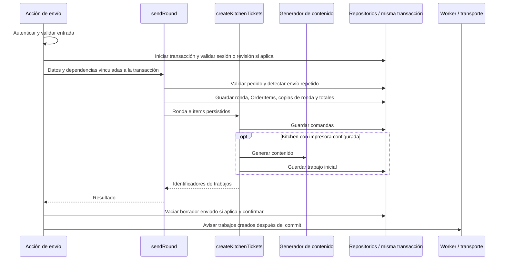

# Kitchens y comandas impresas — diseño técnico del MVP

Fecha: 2026-09-13
Estado: diseño técnico y alcance funcional aprobados por el usuario. No acredita implementación.

## Objetivo

Organizar la preparación de pedidos mediante destinos configurables llamados **Kitchen** y comandas impresas. Cada Kitchen representa un lugar donde se prepara un producto. Sus nombres los define cada negocio; Cocina y Barra dejan de ser destinos fijos del sistema.

Este acuerdo reemplaza, para este MVP, las propuestas anteriores de pantalla de cocina y seguimiento de preparación o entrega, incluidas las de `docs/restaurant-mvp/03-comandas-y-cocina.md`. Las diferencias con el código actual son trabajo de implementación posterior.

## Diseño técnico — decisiones aprobadas

Actualizado: 2026-09-15.

### Comanda y solicitud de impresión

- `KitchenTicket` conserva la identidad estable de la comanda.
- `KitchenTicket` referencia `OrderRound` mediante `orderRoundId` y el destino mediante `kitchenId`. La combinación `orderRoundId + kitchenId` es única.
- Sus productos se consultan en `OrderRoundItem` filtrando por esa ronda y Kitchen. No se agrega una tabla intermedia ni se duplican otra vez las líneas dentro de la comanda.
- `KitchetTicketPrintJob` es el modelo persistido que representa una solicitud de impresión asociada a esa comanda.
- Un reintento automático continúa el mismo trabajo. Una reimpresión explícita crea otro trabajo para la misma comanda, con la marca REIMPRESIÓN y las cantidades vigentes y canceladas.

### Modelo KitchetTicketPrintJob

| Campo | Uso |
| --- | --- |
| `id` | Identificador del trabajo. |
| `companyId` | Empresa propietaria. |
| `kitchenTicketId` | Comanda asociada. |
| `printerId` | Impresora destino de este trabajo. |
| `content` | Bytes ESC/POS finales e inmutables, almacenados como `Bytes` de Prisma (`bytea` en PostgreSQL). |
| `isReprint` | Indica si es una reimpresión manual. |
| `requestedById` | Usuario que originó la solicitud, que puede diferir del responsable original de la ronda. |
| `status` | `PENDING`, `PROCESSING`, `DELIVERED` o `FAILED`. |
| `attempts` | Contador de intentos autorizados, desde 0 hasta el máximo configurado. |
| `nextAttemptAt` | Cuándo corresponde el siguiente intento; vacío cuando no hay uno programado. |
| `claimRequestedAt` | Inicio de la espera para que el cliente reclame un trabajo anunciado; solo tiene valor mientras el trabajo sigue `PENDING` dentro de esa ventana. |
| `processingStartedAt` | Inicio del intento que está en curso; solo tiene valor mientras el trabajo está `PROCESSING`. |
| `lastError` | Último error registrado, si existe. |
| `createdAt`, `updatedAt` | Fechas de creación y actualización. |

El `attemptNumber` enviado al cliente corresponde al contador `attempts` del intento autorizado. La comanda aporta su ronda, Kitchen y responsable original; esos datos no se duplican en el trabajo.

El backend genera `content` con `@point-of-sale/receipt-printer-encoder` dentro de `src/printing/create-kitchen-ticket-content.ts`. La función recibe los datos de la comanda y el perfil de la impresora, y devuelve el `Uint8Array` producido por la librería. El repositorio conserva esos bytes directamente. El endpoint los codifica en Base64 únicamente al construir la respuesta JSON; el cliente .NET los decodifica y entrega sin cambios al spooler. No se guarda Base64 ni una plantilla JSON en la base de datos y no se genera PDF.

### Perfil mínimo de impresora

`Printer` conserva la configuración que el backend necesita para generar ESC/POS:

| Campo | Regla |
| --- | --- |
| `paperWidth` | Enum `MM58` o `MM80`. |
| `columns` | Entero positivo; valor inicial 32 para 58 mm y 42 para 80 mm. Puede ajustarse porque la cantidad real varía entre modelos. |
| `codepageMapping` | Identificador admitido por `ReceiptPrinterEncoder`; valor predeterminado `epson`. |
| `cutEnabled` | Booleano que indica si la plantilla termina con el comando de corte. |
| `feedBeforeCut` | Entero no negativo con la cantidad de líneas que se avanzan antes del corte. |

Estos campos se validan al configurar la impresora. El cliente .NET no los interpreta: recibe los bytes ya generados. No se agregan perfiles por modelo ni drivers propios en este MVP.

### Estado administrativo de Kitchens e impresoras

`Kitchen.status` utiliza el enum `KitchenStatus` y `Printer.status` utiliza `PrinterStatus`. Ambos tienen únicamente `ACTIVE` e `INACTIVE`, con `ACTIVE` como valor predeterminado. Estos campos representan habilitación administrativa; no indican si una impresora está encendida, conectada o presente en el inventario más reciente. Registrar inventario actualiza `lastDetectedAt`, pero nunca cambia `Printer.status`.

El selector de productos devuelve únicamente Kitchens `ACTIVE`, y crear o editar un producto solo acepta una Kitchen `ACTIVE` de la misma empresa. Una Kitchen no puede pasar a `INACTIVE` mientras tenga productos activos asociados. Una Printer no puede pasar a `INACTIVE` mientras esté asignada a una Kitchen; primero se retira la asignación. Una Printer `INACTIVE` no puede asignarse ni recibir trabajos nuevos. Estas transiciones no modifican productos inactivos, rondas, comandas ni trabajos históricos.

| Estado | Significado |
| --- | --- |
| `PENDING` | Espera su primer intento, un reintento programado o el claim de un trabajo ya anunciado. |
| `PROCESSING` | Hay un intento en curso y `processingStartedAt` conserva cuándo comenzó. |
| `DELIVERED` | El sistema de impresión local aceptó el documento; no confirma la salida física del papel. |
| `FAILED` | No quedan reintentos, se requiere corregir la configuración o el cliente informa que no puede confirmar el resultado. |

Un fallo seguro reportado por el cliente vuelve a `PENDING` con `nextAttemptAt` cuando quedan reintentos y limpia las fechas de claim y procesamiento. Agotar el máximo configurado o necesitar corregir la configuración produce `FAILED` con su motivo en `lastError`. No reclamar un aviso ni responder un intento dentro del timeout configurado, y un resultado que el cliente no puede confirmar, producen `FAILED` directamente, sin otro intento automático. Este estado no acredita que no haya salido papel.

### Política única de recuperación de impresión

- La configuración del backend define un único timeout para la espera del claim y para la respuesta de un intento, además del máximo de intentos y las esperas entre reintentos. Los valores predeterminados son 10 segundos de timeout, cuatro intentos totales y esperas de 5, 15 y 30 segundos después de cada fallo seguro.
- Se aplica también a la desconexión del cliente de impresión. El calendario y el contador son compartidos por todo el trabajo; no hay presupuestos independientes de reintentos en backend y cliente.
- El backend es el único coordinador: persiste estado, contador de intentos y próximo intento en `KitchetTicketPrintJob`, programa los reintentos, detiene la recuperación y genera las alertas.
- El cliente .NET ejecuta los intentos autorizados por el backend, conserva su registro local para evitar impresiones duplicadas e informa éxito, fallo seguro o resultado incierto. Mantener o recuperar la conexión no le permite decidir por su cuenta volver a imprimir.
- Solo se inicia otro intento si corresponde por calendario y quedan intentos. Reconectar, reiniciar o recibir otro aviso no reinicia el contador.
- Agotar los intentos produce un fallo visible y exige reimpresión manual. Un resultado incierto detiene los reintentos automáticos y se muestra como `FAILED`.
- No existe un límite global de tiempo por trabajo. La falta de claim se calcula desde `claimRequestedAt` y la falta de resultado desde `processingStartedAt`, usando el mismo timeout configurado; cualquiera termina el trabajo en `FAILED`.
- Al anunciar por primera vez un trabajo habilitado, el backend asigna `claimRequestedAt`. Al autorizar un intento cambia el trabajo a `PROCESSING`, limpia `claimRequestedAt` y asigna `processingStartedAt` en la misma actualización atómica. Al salir de `PROCESSING`, limpia ese campo. Después de un reinicio, el coordinador compara la fecha correspondiente al estado con el timeout configurado y registra `FAILED` cuando venció.

### Identificación de intentos de impresión

- Cada intento se identifica mediante `jobId + attemptNumber`. `jobId` corresponde al `KitchetTicketPrintJob`; `attemptNumber` identifica la autorización de ejecución dentro de ese trabajo.
- El backend incrementa el contador al autorizar un nuevo intento, no al recibir una solicitud repetida. El intento inicial es 1 y el máximo predeterminado es 4.
- Repetir el mismo intento devuelve su resultado conocido sin volver a imprimir. Si sigue ejecutándose, no inicia una segunda ejecución concurrente.
- Un intento nuevo del mismo trabajo necesita autorización del backend tras un fallo seguro, respetando el calendario y el máximo configurado. No cambia el contenido del trabajo.
- Las respuestas incluyen `jobId` y `attemptNumber`; una respuesta atrasada no sobrescribe el resultado de otro intento.
- Una reimpresión manual utiliza otro `jobId` y comienza en el intento 1, con el contenido actualizado de la comanda.
- No se agrega una tabla de intentos en el backend: se utiliza el contador del trabajo y el registro local duradero del cliente.

El resultado reportado por el cliente utiliza este contrato de transporte:

| Resultado | Condición | Transición del trabajo |
| --- | --- | --- |
| `DELIVERED` | El spooler aceptó los bytes completos. | `PROCESSING` → `DELIVERED`. |
| `RETRYABLE_FAILURE` | El cliente puede afirmar que no entregó bytes al spooler. | `PROCESSING` → `PENDING` con `nextAttemptAt` cuando quedan intentos; al agotarlos pasa a `FAILED`. |
| `FAILED` | El cliente pudo haber enviado bytes, no puede confirmar el resultado o detecta un error terminal de configuración o contenido. | `PROCESSING` → `FAILED`, sin otro intento automático. |
| Sin claim | El cliente no reclama el trabajo anunciado dentro del timeout configurado. | `PENDING` → `FAILED`; `attempts` no cambia porque no se autorizó una impresión. |
| Sin respuesta | El backend no recibe un resultado dentro del timeout configurado. | `PROCESSING` → `FAILED` mediante `recordPrintTimeout`. |

`RETRYABLE_FAILURE` no es un estado persistido de `KitchetTicketPrintJob`; describe únicamente el resultado de un intento. Cada reporte incluye `jobId`, `attemptNumber`, resultado y error opcional. `recordPrintResult` acepta el reporte solo si corresponde al intento que continúa `PROCESSING`.

### Cantidad vigente y cancelaciones

- `OrderItem.quantity` conserva su significado actual: es la cantidad vigente de la línea. Los consumidores no deben calcularla restando cancelaciones.
- Se permiten varios `OrderItem` con el mismo `orderId` y `productId`; la política de agrupación depende del tipo de producto y nunca combina líneas de rondas distintas.
- El modelo de dominio de `Product` incorpora `DishProductType` con el discriminador `DishProduct`. Prisma incorpora el valor `DISH` en su enum `ProductType`. Una línea `DishProduct` nunca se fusiona automáticamente con otra: cada línea enviada conserva por separado su cantidad vigente, precio, descuento, importes y notas. Una misma línea puede tener `quantity > 1` cuando varios platos comparten exactamente la misma preparación solicitada.
- Para los demás tipos de producto se conserva su comportamiento de agrupación vigente; este documento no lo redefine. El esquema deja de imponer unicidad por pedido/producto porque debe admitir las líneas separadas de `DishProduct`.
- Se asume que los precios de los platos no cambian durante el servicio. Cada `OrderItem` conserva de todas maneras el precio de su línea; no se requiere versionar precios dentro de `OrderRoundItem`. Este supuesto no exige implementar un bloqueo de edición de precios.
- Cada cancelación identifica el `OrderRoundItem` afectado. Esta decisión sustituye la cancelación sin atribución a una ronda y permite mostrar las cantidades vigentes y canceladas de cada comanda.
- Cada cancelación descuenta directamente la cantidad cancelada de `quantity` y recalcula los importes de la línea y los totales del pedido.
- `OrderItemCancellation` registra cada operación con `orderRoundItemId`, `quantity` cancelada, `reason` opcional, `userId` y `createdAt`. El `OrderItem` exacto se obtiene mediante la relación única del `OrderRoundItem`.
- No se agrega un acumulado `cancelledQuantity` a `OrderItem`: cuando se necesita mostrar el total cancelado, se obtiene del historial.
- Una cancelación completa conserva la línea con `quantity = 0` e importes en cero, manteniendo su relación con la comanda y su historial.
- Al retirar `kitchenStatus`, las consultas de líneas vigentes usan `quantity > 0`. Se deben revisar también los consumidores que asumen cantidades positivas.
- El caso de uso valida empresa, permisos, `paymentStatus = PENDING` y una cantidad positiva que no supere la cantidad pendiente de cancelar del `OrderRoundItem` ni la cantidad vigente de su `OrderItem`. El registro de cancelación, la reducción de `OrderItem.quantity` y el recálculo son atómicos y se protegen frente a cancelaciones y cobros simultáneos.
- Las devoluciones no forman parte del alcance actual. Un pedido con `paymentStatus = PAID` rechaza la cancelación de platos mediante este flujo.

Ejemplo: una línea enviada con 3 lomos pasa a `quantity = 2` al cancelar 1, y se registra una cancelación de cantidad 1. La reimpresión muestra 2 vigentes y 1 cancelado. Si se cancelan los 2 restantes, la línea permanece con cantidad e importes en cero y el historial suma 3 cancelados.

### Ronda y copia de lo solicitado

- Se incorpora `OrderRound` para representar cada envío y guardar su responsable.
- La ronda tiene registros `OrderRoundItem` con los datos de los ítems solicitados en ese envío. Esta decisión reemplaza la propuesta de conservarlos en JSONB.
- Cada `OrderRoundItem` tiene identificador propio, pertenece a un `OrderRound` mediante `orderRoundId` y contiene `orderItemId`, `productId`, `productName`, `quantity`, `notes` y `kitchenId` opcional. `orderItemId` y `productId` relacionan la copia con la línea vigente y el producto, respectivamente.
- `productName`, `quantity`, `notes` y `kitchenId` conservan los valores del envío. La duplicación es intencional para facilitar la consulta de lo solicitado sin reconstruirlo desde datos vigentes; no acredita una mejora de rendimiento medida.
- Después de aplicar la política del tipo de producto dentro de la ronda, cada línea resultante crea su propio `OrderItem` y un `OrderRoundItem` correspondiente. `OrderRoundItem.orderItemId` es único: una línea comercial de restaurante pertenece a una sola ronda. Los `OrderItem` de otros tipos de venta pueden no tener un `OrderRoundItem`.
- Una ronda puede contener varias líneas `DishProduct` del mismo producto, incluso con notas diferentes. Una ronda posterior siempre crea nuevos `OrderItem` y `OrderRoundItem`; la agrupación nunca cruza rondas.
- La entrada de `sendRound` admite elementos repetidos con el mismo `productId` y no necesita un `lineId`. Para `DishProduct`, cada posición del arreglo se conserva como una línea independiente y genera su propio `OrderItem`; la posición no se persiste ni se utiliza como identidad después del envío.
- Por ejemplo, pedir 2 lomos sin cebolla y 1 término medio crea dos `OrderItem` con cantidades 2 y 1, y dos copias de ronda que apuntan a sus respectivas líneas. La comanda conserva ambas preparaciones; cancelar una afecta únicamente su línea.
- Las cancelaciones modifican `OrderItem` y agregan registros a `OrderItemCancellation`; no reescriben los datos de lo solicitado en `OrderRoundItem`.
- El responsable pertenece a `OrderRound`, no se duplica en cada `KitchenTicket` generado por ese envío.
- La cantidad vigente de cada `OrderRoundItem` para reimpresión se obtiene de la cantidad originalmente enviada menos sus cancelaciones registradas. Su `OrderItem.quantity` almacena directamente la cantidad vigente de esa línea.
- `Document` puede presentar los `OrderItem` por separado o agruparlos al consultar. La persistencia conserva el detalle de cantidad, notas e importes de cada línea para que el formato del documento no determine el modelo de escritura.

El enum `ProductType` de Prisma persiste `DISH`, pero ese tipo generado no sale de `src/product/db_repository.ts`. El repositorio traduce en ambos sentidos entre `DISH` y el discriminador de dominio `DishProductType`; las consultas devuelven `Product`, no `Prisma.Product` ni `$Enums.ProductType`. `sendRound` recibe por inyección la consulta de productos tipada con el contrato de dominio existente y decide la agrupación usando `product.type`. No importa `@prisma/client`, no conoce los valores de persistencia y no necesita un DTO adicional para esta decisión.

El contrato mínimo en `src/product/types.ts` sigue la unión discriminada existente:

```ts
export const DishProductType = "DishProduct";

export type DishProduct = ProductBase & {
  type: typeof DishProductType;
};
```

`DishProduct` se agrega a `Product` y a `ProductTypeMap`; no incorpora campos particulares ni administra inventario en este MVP. Al crear o actualizar un `DISH`, el repositorio guarda `stock`, `unitType`, `purchasePrice`, `targetMovementProductId` y `targetMovementProductStock` como `NULL`. Esas columnas no forman parte del contrato `DishProduct`.

Los formularios de producto incluyen `DishProduct` como opción. Para este tipo muestran únicamente los campos comunes de `Product` y el selector opcional de Kitchen; no muestran ni envían campos de inventario. Crear y editar reutilizan el mismo contrato `DishProduct`, sin valores ficticios para satisfacer el formulario de `SingleProduct`.

Las ramas de lectura, creación y actualización de `src/product/db_repository.ts` hacen la traducción explícita. En particular, la lectura de un `DISH` no puede caer en el caso por defecto que hoy construye un `SingleProduct`, ni completar artificialmente campos de inventario. Este ajuste pertenece al mismo cambio del repositorio y no requiere refactorizar previamente `sendRound`.

No se copia `productType` a `OrderItem` ni a `OrderRoundItem`: el tipo se consulta al validar el producto antes de crear las líneas, y el resultado de la política queda materializado en los registros separados.

### Enviar ronda

El flujo aprobado guarda en una misma transacción:

1. La validación del pedido y los productos solicitados, antes de realizar escrituras.
2. Un `OrderRound` con el responsable y el siguiente número correlativo del pedido.
3. La aplicación de la política de agrupación según el tipo de dominio del producto; las líneas `DishProduct` permanecen separadas.
4. La creación de un `OrderItem` y un `OrderRoundItem` por cada línea resultante, con los datos de lo solicitado y su `orderItemId` único.
5. El recálculo de los totales del pedido.
6. Una `KitchenTicket` por cada Kitchen involucrada, agrupando los ítems de la ronda por destino. Los productos sin Kitchen permanecen en el pedido y no generan comanda.
7. Un `KitchetTicketPrintJob` por comanda cuya Kitchen tenga una impresora configurada.

`createKitchenTickets` siempre crea cada comanda dentro de la transacción del envío. Cuando la Kitchen tiene una impresora configurada, genera el contenido y crea también su primer `KitchetTicketPrintJob`; después del commit se avisa al cliente de impresión. Cuando no tiene impresora, conserva la `KitchenTicket` sin trabajos. La ronda no falla y no se crean valores incompletos: `printerId` y `content` siguen siendo obligatorios en todo trabajo.

### Protección contra envíos repetidos

- Se utiliza el propio `OrderRound.id`, generado antes de enviar la solicitud. No se agrega un campo `requestId` separado.
- Los reintentos del mismo envío conservan ese identificador. Un envío nuevo utiliza otro.
- Si el envío ya fue confirmado, se devuelve la ronda existente sin volver a crear `OrderItem`, comandas ni trabajos de impresión.
- `OrderRound.number` comienza en 1 y es correlativo dentro de cada pedido. El cliente no lo envía: después de bloquear el `Order`, `sendRound` calcula `MAX(number) + 1` y crea la ronda en la misma transacción.
- Dos envíos nuevos con identificadores diferentes se serializan mediante el mismo bloqueo del pedido que protege cantidades y totales. No se agrega `nextRoundNumber` a `Order`; `UNIQUE (orderId, number)` permanece como última protección.
- Repetir un `OrderRound.id` ya confirmado devuelve también el número asignado originalmente. Las rondas no se eliminan, por lo que un número anterior no se reutiliza.
- La comprobación y persistencia deben proteger también solicitudes simultáneas con el mismo identificador; una consulta previa por sí sola no es suficiente. Los cambios del intento duplicado no deben confirmarse.
- La búsqueda de una ronda existente respeta empresa, pedido y permisos. Conocer el identificador no permite consultar rondas ajenas ni reutilizarlo para otro pedido.
- En mesas se conserva además la validación de revisión del borrador para impedir enviar dos veces el mismo borrador con identificadores distintos. Reconocer un envío ya confirmado no debe vaciar un borrador posterior.

### Ubicación de las rondas

- Las rondas pertenecen a un submódulo de `order`, ubicado en `src/order/rounds/`.
- El submódulo concentra los tipos, validaciones, persistencia y casos de uso de las rondas, sus ítems y las cancelaciones por ítem de ronda.
- Se comparte entre pedidos de mesas, para llevar y delivery. `table` conserva la gestión de mesas, sesiones y borradores y utiliza el flujo de rondas de `order`.
- La estructura aprobada del submódulo es:

```text
src/order/rounds/
  types.ts
  schema.ts
  db_repository.ts
  actions.ts
  use-cases/
    send-round.ts
    cancel-round-item.ts
```

- Los contratos y su composición con `kitchen` y `printing` se detallan en la sección de arquitectura de este documento.

### Contrato de cancelación de un ítem de ronda

`cancelRoundItem` recibe:

- `cancellationId`: identificador del registro `OrderItemCancellation`, generado antes de enviar la solicitud y conservado en sus reintentos.
- `orderRoundItemId`: ítem de ronda afectado.
- `quantity`: cantidad a cancelar.
- `reason`: motivo opcional.

La acción aporta `companyId` y `userId` desde el contexto autenticado.

Dentro de una misma transacción, el flujo:

1. Comprueba si esa cancelación ya se procesó, respetando empresa, pedido y permisos. Una solicitud repetida devuelve la operación existente sin volver a descontar cantidades.
2. Obtiene el ítem de ronda, sus cancelaciones y el pedido.
3. Valida permisos, `paymentStatus = PENDING` y cantidad disponible para cancelar.
4. Crea `OrderItemCancellation`.
5. Descuenta de `OrderItem.quantity` y recalcula los importes de la línea y del pedido.

La protección cubre también solicitudes simultáneas. Se conserva la cantidad original de `OrderRoundItem`; la vigente de la comanda se obtiene restando sus cancelaciones. La cancelación no genera una impresión automática.

### Ubicación de comandas y trabajos

`KitchenTicket` y `KitchetTicketPrintJob` pertenecen a `kitchen`. La estructura aprobada es:

```text
src/kitchen/
  types.ts
  db_repository.ts
  actions.ts
  process-print-jobs.ts
  use-cases/
    get-kitchens.ts
    create-kitchen.ts
    update-kitchen.ts
    create-kitchen-tickets.ts
    get-kitchen-tickets.ts
    print-kitchen-ticket.ts
    reprint-kitchen-ticket.ts
    authorize-print-attempt.ts
    record-print-result.ts
    record-print-timeout.ts
```

- `getKitchens` obtiene las Kitchens de la empresa. Para el selector de producto devuelve únicamente `id` y `name` de las que están `ACTIVE`; la vista administrativa puede solicitar todos los estados y la impresora configurada.
- `createKitchen` crea una Kitchen con nombre e impresora opcional.
- `updateKitchen` cambia el nombre, `status` y la asignación opcional de impresora sin modificar los productos asociados.
- `createKitchenTickets` crea las comandas por ronda y destino; crea el primer `KitchetTicketPrintJob` únicamente para las Kitchens que ya tienen impresora, dentro de la misma transacción y utilizando el generador de contenido inyectado desde `printing`.
- `getKitchenTickets` obtiene las comandas visibles para el usuario autenticado y encapsula el alcance según su rol.
- `printKitchenTicket` crea manualmente el primer trabajo de una comanda que todavía no tiene ninguno, una vez que su Kitchen cuenta con impresora.
- `reprintKitchenTicket` genera otra solicitud de impresión para la comanda.
- `authorizePrintAttempt` atiende el `POST` de claim del cliente: valida identidad, destino, estado, calendario y máximo de intentos; incrementa el contador y autoriza un único intento.
- `recordPrintResult` valida el cliente y número de intento, registra el resultado y programa el siguiente reintento cuando corresponde.
- `recordPrintTimeout` marca como `FAILED` un trabajo anunciado que no fue reclamado o un intento `PROCESSING` sin respuesta cuando la fecha correspondiente superó el timeout configurado.
- `process-print-jobs.ts` es el borde de aplicación ejecutado por `src/worker.ts`: inicia ventanas de claim, publica o repite avisos con `jobId` y llama a `recordPrintTimeout` cuando corresponde.
- `src/printing/create-kitchen-ticket-content.ts` usa `@point-of-sale/receipt-printer-encoder` para producir los bytes ESC/POS a partir de la comanda y del perfil de la impresora.
- `src/printing` concentra generación de contenido imprimible y comunicación con dispositivos. No es dueño de las reglas ni de la persistencia de los trabajos de comanda.
- El worker y los endpoints conectan la infraestructura de impresión con los casos de uso de `kitchen`.

### Primera impresión pendiente por falta de impresora

No se agrega un estado persistido a `KitchenTicket`. Mientras la comanda no tenga trabajos y conserve al menos un ítem con cantidad vigente positiva, `getKitchenTickets` deriva `NO_PRINTER_CONFIGURED` si su Kitchen sigue sin impresora y `NOT_PRINTED` si ya fue configurada. Configurar una impresora no crea ni envía automáticamente trabajos para comandas anteriores.

El responsable de la ronda o un administrador puede ejecutar `printKitchenTicket` cuando la comanda no tiene trabajos, conserva al menos un ítem vigente y la Kitchen ya tiene impresora. El caso de uso bloquea la comanda, vuelve a comprobar estas condiciones, obtiene sus ítems y cancelaciones para calcular las cantidades vigentes, genera el contenido con el perfil y destino actuales y guarda el primer `KitchetTicketPrintJob` con `isReprint = false`. El contenido incluye únicamente líneas con cantidad vigente positiva; no muestra cantidades canceladas porque cocina nunca recibió una impresión anterior. Después del commit avisa al cliente. Solicitudes simultáneas no pueden crear dos primeros trabajos. Esta impresión no lleva la marca **REIMPRESIÓN**.

Si todas las cantidades vigentes llegaron a cero antes de crear el primer trabajo, la `KitchenTicket` se conserva como historial, deja de aparecer en el modal y `printKitchenTicket` rechaza la operación. No se crea un trabajo vacío ni se elimina la comanda. Esta regla solo aplica a comandas que nunca tuvieron trabajos; cuando hubo un intento anterior, sus fallos y reimpresiones conservan las reglas acordadas porque el documento pudo haber llegado a cocina.

### Reimpresión de una comanda

El flujo de `reprintKitchenTicket`:

1. Recibe `kitchenTicketId` y el identificador del nuevo trabajo de impresión.
2. Valida la empresa y que el usuario sea el responsable de la ronda o un administrador.
3. Si el mismo `jobId` ya fue procesado con la misma solicitud, devuelve ese trabajo. Para una solicitud nueva, exige que la comanda tenga al menos un trabajo anterior y rechaza la reimpresión si existe cualquier trabajo `PENDING` o `PROCESSING`, sea original o reimpresión.
4. Obtiene los `OrderRoundItem` de esa ronda y Kitchen, junto con sus cancelaciones.
5. Genera contenido marcado REIMPRESIÓN, con el mismo identificador de comanda, cantidades vigentes y canceladas de esa ronda. No incluye cancelaciones de otras rondas.
6. Guarda otro `KitchetTicketPrintJob` y, después de confirmar la persistencia, avisa al cliente de impresión.

La comprobación de trabajos activos y la creación del nuevo trabajo son atómicas, con protección por comanda frente a reimpresiones simultáneas. Una reimpresión no reinicia el trabajo anterior ni exige que haya fallado. Se mantienen la autorización por empresa y los permisos del responsable de la ronda y del administrador.

### Adopción del nuevo modelo

El usuario confirmó que todavía no hay empresas utilizando restaurantes ni rondas existentes que deban conservarse. No se requiere convertir pedidos o rondas históricos de restaurante, reconstruir sus envíos ni mantener compatibilidad con el modelo anterior de rondas. La implementación incluye la migración de estructura necesaria para los modelos y restricciones nuevos.

## Arquitectura y contratos

Este apartado define responsabilidades, relaciones y contratos a partir del código actual.

| Área | Archivos principales | Responsabilidad técnica |
| --- | --- | --- |
| Datos | `prisma/schema.prisma`, migración de estructura | Modelos de Kitchen, rondas, ítems de ronda, cancelaciones, comandas y trabajos con sus relaciones e índices. No hay conversión de historial de restaurante. |
| Rondas | `src/order/rounds/` | Envío y cancelación, líneas comerciales y sus copias de ronda, historial e identificadores de operación. |
| Integración con mesas | `src/table/actions.ts`, `draft-repository.ts`, `db_repository.ts`, `use-cases/add-round.ts`, `use-cases/cancel-order-item.ts` | Sesión, revisión del borrador y protección frente al cobro. Los envíos utilizan los casos de uso comunes de rounds en lugar de persistencia duplicada. |
| Productos | `src/product/types.ts`, `schema.ts`, `db_repository.ts`, `components/form/store.ts`, selector de tipo, campo de Kitchen y formularios consumidores | Kitchen opcional de la misma empresa; contrato `DishProduct`, formulario sin inventario y traducción privada entre ese discriminador y `ProductType.DISH` de Prisma. |
| Comandas y trabajos | `src/kitchen/types.ts`, `actions.ts`, `db_repository.ts`, casos de uso aprobados | Configuración de Kitchens, comandas por ronda/destino, persistencia de KitchetTicketPrintJob, autorización de intentos, resultados y reimpresión con cancelaciones. |
| Infraestructura de impresión | `src/printing/create-kitchen-ticket-content.ts`, `src/printing/clients/`, resto de `src/printing/` y rutas bajo `src/app/api/printing/` | Generación de bytes ESC/POS con `@point-of-sale/receipt-printer-encoder`, códigos de vinculación, autenticación de clientes y comunicación con dispositivos. La persistencia y las reglas de trabajos de comanda pertenecen a kitchen; la impresión existente de comprobantes iMin conserva su propio flujo. |
| Coordinación en segundo plano | `src/worker.ts`, `src/kitchen/process-print-jobs.ts` | Coordinador de impresión dentro del worker existente; recuperación desde estado persistido según calendario, intentos y fallos terminales. |
| Cuenta y caja | `src/table/payment-repository.ts`, `use-cases/request-bill.ts`, `src/cash-shift/db_repository.ts`, consumidores de `src/order` | Cantidades vigentes, controles financieros, recálculo y líneas en cero; la vigencia comercial depende de quantity en lugar de kitchenStatus. |
| Documentos y comprobantes | `src/document/factpro/gateway.ts`, `src/document/generate-invoice-pdf-stream.tsx`, `src/printing/receipt-builder.ts` y consultas de Order | Consumir múltiples OrderItem del mismo producto. El formato puede conservar cada línea o agruparlas al leer sin perder las notas e importes persistidos. |
| Interfaz y permisos | `src/table/types.ts`, `components/table-order-view.tsx`, `table-actions-menu.tsx`, `table-grid.tsx`, `src/authorization/permissions.ts`, `default-route.ts` | Consulta de rondas, cancelaciones, alertas y reimpresión con autorización. Los controles de preparación/servido y las rutas que dependen de la pantalla de cocina dejan de representar la operación del MVP. |

### Acoplamientos del código actual

Los dos caminos actuales de envío duplican persistencia y deben converger en los mismos casos de uso con una transacción compartida. `sendTableDraft` protege la revisión del borrador; esa protección se conserva. `addRoundAction` utiliza `withinTransaction`, que reemplaza temporalmente el cliente global. El diseño utiliza una transacción explícita, pasada a los repositorios desde el borde de aplicación, para evitar que operaciones concurrentes compartan accidentalmente el cliente transaccional.

Los carritos actuales de mesa buscan y editan sus entradas por `productId`. Para `DishProduct` deben añadir otra posición al arreglo y editarla por su índice; no se agrega un identificador de línea al contrato ni a la persistencia. El servidor recibe todas las posiciones y crea un `OrderItem` independiente por cada una. Los tipos cuya política permita agrupación conservan la búsqueda por `productId`.

La dependencia de `kitchenStatus` en cuenta, cobro y reportes se sustituye por `OrderItem.quantity` vigente. Los datos de preparación y servido dejan de formar parte del modelo operativo. El alcance de este ajuste comprende los consumidores de restaurante afectados, no una reescritura general de todos los consumidores del helper global.

### Resumen de modelos y relaciones

| Modelo | Datos principales | Relación o restricción |
| --- | --- | --- |
| `Kitchen` | `id`, `companyId`, `name`, `status: KitchenStatus`, `printerId` opcional | `status` es `ACTIVE` o `INACTIVE`; la configuración de su impresora es independiente de los productos asociados. |
| `PrintClientLinkCode` | `id`, `companyId`, `codeHash`, `expiresAt`, `createdById`, `createdAt` | Código de un solo uso; `codeHash` es un HMAC-SHA-256 único y se consume atómicamente al crear el cliente. |
| `PrintClient` | `id`, `companyId`, `machineName`, `credentialHash`, `revokedAt` opcional, `lastSeenAt`, `lastInventoryAt` opcional, `createdAt`, `updatedAt` | Una instalación pertenece a una empresa; la credencial se entrega una vez y solo se persiste su SHA-256. `lastSeenAt` refleja operaciones HTTPS reales y `lastInventoryAt` identifica la última lista completa aceptada. |
| `Printer` | Identidad del cliente y cola, `status: PrinterStatus`, `lastDetectedAt`, `paperWidth`, `columns`, `codepageMapping`, `cutEnabled`, `feedBeforeCut` | `status` es administrativo y no representa conexión; el resto es la configuración mínima para generar ESC/POS. |
| `Product` | `kitchenId` opcional y discriminador de dominio, incluido `DishProduct` | Cero o una Kitchen de la misma empresa; no conoce ni valida impresoras. El repositorio encapsula la traducción de `ProductType.DISH` de Prisma y persiste en `NULL` sus columnas de inventario. |
| `Order` | `status` existente y nuevo `paymentStatus` | `status` representa el ciclo del pedido; `paymentStatus` representa únicamente si está pendiente o pagado. |
| `OrderItem` | Producto, cantidad vigente, precio, descuento, importes y notas | Una línea comercial resultante de la política del tipo de producto; se permiten varias del mismo producto. En restaurante tiene como máximo una copia OrderRoundItem. |
| `OrderRound` | `id`, `orderId`, `number`, `responsibleUserId`, `createdAt` | Pertenece a un pedido; número único dentro del pedido; identificador conservado al reintentar el envío. |
| `OrderRoundItem` | `id`, `orderRoundId`, `orderItemId`, `productId`, `productName`, `quantity`, `notes`, `kitchenId` opcional | Conserva lo solicitado; `orderItemId` es único y enlaza la copia con su línea comercial. |
| `OrderItemCancellation` | `id`, `orderRoundItemId`, `quantity`, `reason` opcional, `userId`, `createdAt` | Historial de cancelaciones del ítem de ronda; el identificador evita repetir la operación. |
| `KitchenTicket` | `id`, `orderRoundId`, `kitchenId` | Una comanda por ronda/Kitchen; obtiene sus líneas desde OrderRoundItem. |
| `KitchetTicketPrintJob` | Campos y estados aprobados en su sección | Pertenece a una comanda y una impresora; varias solicitudes por comanda, una ejecución autorizada a la vez por trabajo. |

Los modelos del cliente de impresión y su inventario de impresoras se detallan en `2026-09-13-cliente-impresion-dotnet-design.md`. Las cantidades y los importes conservan las representaciones numéricas utilizadas por el pedido; los registros de ronda no incorporan un cálculo de precios independiente.

### Contratos e interacción

Los siguientes contratos concretan la composición. Los casos de uso reciben dependencias explícitas y devuelven `response<T>`; no importan Prisma, sesiones, colas ni módulos de Next.js. Las acciones y endpoints aportan identidades autenticadas y coordinan transacciones, notificaciones y revalidación.

| Caso de uso | Entrada de negocio | Dependencias inyectadas | Resultado |
| --- | --- | --- | --- |
| `getKitchens` | Empresa autenticada y variante `PRODUCT_SELECTOR` o `ADMIN` | Consultar Kitchens de la empresa y, solo para administración, todos sus estados y su impresora | Para producto, lista de `{ id, name }` de Kitchens `ACTIVE`; para administración, Kitchens con estado y configuración de impresora |
| `createKitchen` | `name`, `printerId` opcional; empresa y administrador autenticados | Validar nombre, exigir una Printer `ACTIVE` de la misma empresa cuando corresponda y guardar Kitchen con `status = ACTIVE` | Kitchen creada |
| `updateKitchen` | `kitchenId`, `name`, `status`, `printerId` opcional; empresa y administrador autenticados | Obtener Kitchen, validar nombre y destino, comprobar asignación exclusiva, exigir una Printer `ACTIVE` y bloquear el paso a `INACTIVE` mientras existan productos activos | Kitchen actualizada sin modificar productos inactivos ni historial |
| `updatePrinter` | `printerId`, `status`, `paperWidth`, `columns`, `codepageMapping`, `cutEnabled`, `feedBeforeCut`; empresa y administrador autenticados | Obtener impresora, validar el perfil y bloquear el paso a `INACTIVE` mientras tenga una Kitchen asignada | Printer actualizado sin modificar trabajos históricos |
| `sendRound` | `roundId`, `orderId`, arreglo de líneas con `productId`, `quantity`, `notes`, permitiendo `productId` repetidos y sin `lineId`; empresa y responsable autenticados | Obtener y bloquear el pedido, buscar ronda existente, calcular el siguiente `number`, consultar `Product[]` mediante el contrato del repositorio de producto, aplicar la agrupación usando el discriminador de dominio, crear cada OrderItem y su OrderRoundItem, recalcular totales y crear comandas mediante `createKitchenTickets` | Ronda con sus líneas, número e identificadores de trabajos creados, o resultado del envío ya procesado |
| `createKitchenTickets` | Ronda persistida con sus ítems y usuario solicitante | Consultar destinos, guardar comandas y, cuando exista impresora configurada, generar contenido y guardar el primer trabajo | Comandas y trabajos creados para los destinos configurados |
| `getKitchenTickets` | Empresa, usuario y rol autenticados; filtros de pedido o de atención requerida cuando correspondan | Consultar comandas, rondas responsables, Kitchen actual, último trabajo y cantidades canceladas/vigentes dentro del alcance autorizado | Comandas visibles con motivo derivado, último trabajo, trabajo activo, `canPrint` y `canReprint` |
| `cancelRoundItem` | Contrato aprobado de cancelación | Obtener ítem y cancelaciones bajo protección del pedido, buscar cancelación existente, guardar cancelación y actualizar cantidades/importes | Cancelación y totales vigentes del pedido |
| `printKitchenTicket` | `kitchenTicketId`, nuevo `jobId`; empresa, usuario y rol autenticados | Bloquear y obtener una comanda sin trabajos, calcular cantidades vigentes, consultar el destino actual, generar contenido solo con líneas positivas y guardar el primer trabajo | Primer trabajo sin cancelaciones visibles y con `isReprint = false`, el ya registrado para ese identificador o rechazo si ya no quedan ítems vigentes |
| `reprintKitchenTicket` | `kitchenTicketId`, nuevo `jobId`; empresa, usuario y rol autenticados | Obtener comanda, ronda e ítems con cancelaciones, consultar destino, generar contenido, buscar/guardar trabajo | Trabajo de reimpresión, o el ya registrado para ese identificador |
| `authorizePrintAttempt` | `jobId`, hora e identidad autenticada del cliente que realizó el claim | Consultar trabajo/destino, validar que la impresora pertenece al cliente y efectuar la actualización condicional de estado, contador y fechas | Intento autorizado con `jobId`, `attemptNumber`, destino, contenido y timeout configurado; o el mismo intento ya reclamado por ese cliente |
| `recordPrintResult` | `jobId`, `attemptNumber`, resultado `DELIVERED`, `RETRYABLE_FAILURE` o `FAILED`, y error opcional; identidad autenticada del cliente | Consultar trabajo, validar pertenencia al cliente y actualizar condicionalmente el intento actual | Estado persistido y, solo para `RETRYABLE_FAILURE`, programación del próximo intento cuando corresponda |
| `recordPrintTimeout` | `jobId`, estado y fecha de inicio observados, hora actual y timeout configurado | Actualizar condicionalmente solo si conserva el mismo estado y `claimRequestedAt` o `processingStartedAt` observado continúa vencido | Trabajo `FAILED`, o ausencia de cambio si la espera cambió o todavía está vigente |
| `registerPrinterInventory` | Cliente autenticado; `version: 1`; lista completa de `{ localName }`, incluso vacía | Hacer upsert por cliente/nombre local y actualizar el momento del inventario dentro de una transacción | Inventario aceptado con `lastInventoryAt` y cantidad registrada |

Decisión aprobada: `createKitchenTickets` guarda todas las comandas y crea el primer trabajo solo cuando la Kitchen tiene impresora configurada. `printKitchenTicket` cubre la primera impresión manual de una comanda que quedó sin trabajo; `reprintKitchenTicket` se usa cuando ya existe al menos un trabajo. Ambos reutilizan la función de generación de contenido inyectada desde `printing`.

El producto solo conoce `kitchenId`. Al crearlo o editarlo se valida que la Kitchen exista y pertenezca a la misma empresa; no se consulta `printerId`, `Printer`, inventario, conexión ni actividad. La configuración, sustitución o retiro de la impresora pertenece al módulo Kitchen y no depende de los productos asociados. `createKitchenTickets` resuelve el destino de impresión al enviar la ronda.

Las mutaciones de Kitchen y Printer requieren el rol `ADMIN`. Asignar una impresora valida que esté `ACTIVE`, pertenezca a la misma empresa y que ninguna otra Kitchen la utilice, respaldado por `UNIQUE (printerId)`. No exige que el dispositivo esté encendido, presente en el último inventario ni conectado en ese momento. Retirar o reemplazar la asignación actualiza únicamente `Kitchen.printerId`; los productos mantienen su `kitchenId` y los trabajos existentes conservan su `printerId` y contenido. `updatePrinter` pertenece a `src/printing/clients/use-cases/` porque modifica el estado y perfil técnico del dispositivo; `kitchen` solo conserva la asignación.

Los casos de uso de producto validan `Kitchen.status = ACTIVE` además de empresa. `createKitchenTickets` vuelve a validar que la Kitchen y su Printer configurada estén `ACTIVE` al crear trabajos nuevos. Las consultas históricas no aplican estos filtros: conservan las relaciones aunque después cambien los estados.



El diagrama muestra un envío nuevo. Si la ronda ya existe, se devuelve antes de realizar escrituras y no se vacía un borrador posterior. Un fallo posterior a una escritura revierte la transacción completa; devolver `success: false` no debe confirmar cambios parciales. La comunicación con el dispositivo ocurre después del commit. Los trabajos persistidos permiten recuperar un aviso perdido desde el coordinador, sin recrear la ronda.

### Coordinación de trabajos de impresión

`src/worker.ts` ejecuta `src/kitchen/process-print-jobs.ts`; no se crea otro servicio. Después del commit que crea un trabajo se avisa al worker para procesarlo pronto. Ese aviso no es la fuente de verdad: el coordinador también consulta periódicamente la base de datos para recuperar avisos perdidos y continuar después de un reinicio.

En cada ejecución, el coordinador:

1. Busca el trabajo habilitado más antiguo de cada impresora sin otro trabajo anunciado o `PROCESSING`; debe estar `PENDING`, tener `nextAttemptAt` vacío o vencido y no tener `claimRequestedAt`.
2. Asigna `claimRequestedAt` de forma condicional y publica por Realtime `{ type: "PRINT_JOB_AVAILABLE", version: 1, jobId }` en el canal público dirigido al cliente propietario de la impresora. El aviso no contiene destino ni contenido imprimible. Una restricción parcial asegura una sola reserva de claim o ejecución por impresora.
3. Puede volver a publicar el mismo aviso mientras el trabajo siga `PENDING` y la ventana de claim continúe vigente, sin cambiar `claimRequestedAt` ni autorizar un intento.
4. Llama a `recordPrintTimeout` para los trabajos `PENDING` cuyo `claimRequestedAt` o `PROCESSING` cuyo `processingStartedAt` superaron el mismo timeout configurado.

El cliente reclama el trabajo identificado mediante `POST /api/printing/jobs/{jobId}/claim`. Ese endpoint autentica al `PrintClient` y llama a `authorizePrintAttempt`, que exige una ventana de claim vigente, cambia atómicamente `PENDING` a `PROCESSING`, incrementa `attempts`, limpia `claimRequestedAt` y asigna `processingStartedAt`. La respuesta JSON contiene `jobId`, `attemptNumber`, `printerId`, `printerLocalName`, `contentBase64` y el timeout. No se usa un `GET` para esta operación.

Solo puede existir un trabajo `PROCESSING` por impresora. Si la impresora ya ejecuta otro trabajo, el claim no modifica el candidato, que permanece `PENDING` y volverá a ser anunciado. Repetir el POST del mismo `jobId` por el mismo cliente devuelve el intento `PROCESSING` ya autorizado sin incrementar `attempts`. Un trabajo terminal, fuera de calendario o perteneciente a otro cliente no entrega contenido imprimible.

El resultado se registra mediante `POST /api/printing/jobs/{jobId}/result`. El backend autentica nuevamente al cliente y valida `attemptNumber` antes de llamar a `recordPrintResult`. El mismo mecanismo admite más de una instancia del worker o del backend: las actualizaciones condicionales deciden qué proceso puede reclamar o vencer un trabajo. Los estados terminales no vuelven a entrar al coordinador.

### Vinculación y autenticación HTTPS del cliente de impresión

`src/printing/clients/` contiene tipos, repositorio y los casos de uso `createPrintClientLinkCode`, `linkPrintClient` y `registerPrinterInventory`, además de la autenticación común para inventario, claim y resultado. Las rutas web autentican al administrador para generar códigos; las rutas del cliente validan su entrada y delegan en esos casos de uso.

Un administrador genera en la web un código numérico de cuatro dígitos, de un solo uso y con vigencia de diez minutos. El usuario lo escribe una vez en el instalador. Se representa como texto para conservar ceros iniciales, por ejemplo `0047`, y se valida con `^\d{4}$`. PostgreSQL conserva un `PrintClientLinkCode` con `id`, `companyId`, `codeHash`, `expiresAt`, `createdById` y `createdAt`; el código original se muestra una vez y nunca se persiste. `codeHash` se calcula como `HMAC-SHA-256(PRINT_CLIENT_LINK_CODE_SECRET, code)` para impedir enumerar fuera de línea las 10 000 combinaciones a partir de una copia de la base de datos. El secreto vive únicamente en la configuración del backend. `codeHash` es único y, al generar, el backend vuelve a intentar si coincide con otro código todavía vigente.

Durante la instalación, `POST /api/printing/clients/link` recibe el código y `machineName`. `linkPrintClient` busca su hash vigente y, dentro de una sola transacción, elimina el código y crea el `PrintClient`; después devuelve una sola vez `printClientId` y una credencial `lpk_{token}`, donde `token` son 32 bytes aleatorios codificados como Base64URL. El backend persiste únicamente su SHA-256 porque la credencial tiene suficiente entropía; el usuario no la escribe. Un código vencido, usado o desconocido produce el mismo rechazo y no crea un cliente. Si la respuesta se pierde después del commit, se genera otro código y se vincula un cliente nuevo; el administrador puede revocar el registro que quedó sin uso. No se conserva la credencial en texto plano para permitir recuperarla. El mecanismo con el que Windows la protege pertenece a la aplicación .NET y queda fuera de esta iteración del backend.

Por tener solo 10 000 combinaciones, el endpoint permite cinco intentos fallidos por dirección IP durante una ventana de diez minutos. Antes de buscar el código, consulta en Redis si esa dirección ya alcanzó el límite y, en ese caso, responde `429`. Cada intercambio inválido incrementa el contador temporal; un vínculo exitoso no lo incrementa. La dirección se obtiene de la información de red confiable que aporte el despliegue, no de un valor libre del cuerpo. Redis no almacena el código ni decide su validez: PostgreSQL conserva el registro y confirma su consumo junto con la creación del cliente.

Los códigos vencidos se eliminan oportunísticamente al generar o intercambiar códigos. No se agrega un worker ni una tarea periódica para limpiarlos.

El cliente presenta la credencial como Bearer al registrar inventario, reclamar trabajos y reportar resultados. La autenticación resuelve `companyId` y `printClientId` en el servidor; ningún endpoint confía en identificadores de alcance enviados por el cliente.

Realtime utiliza el canal público `print-client:{printClientId}` y reutiliza la integración Supabase existente. `src/printing/clients/realtime.ts` publica directamente mediante `getRealtimeProvider()` sin cambiar el contrato general de canales de la web. Solo transporta avisos con `type`, `version` y `jobId`, o la solicitud de actualizar inventario; no incluye contenido ESC/POS, destino, datos del pedido ni credenciales. No se agrega emisión de JWT, Supabase Auth, políticas privadas ni una credencial de servidor adicional para este flujo. Conocer el canal o un `jobId` no permite reclamar ni modificar el trabajo porque cada POST vuelve a autenticar la credencial y valida su pertenencia.

Revocar el `PrintClient` rechaza posteriores operaciones HTTPS, incluidos claims y resultados. El cliente puede continuar recibiendo avisos públicos, pero estos no permiten imprimir. Si la revocación ocurre después de que Windows aceptó físicamente un trabajo y antes de reportar el resultado, el backend rechazará ese resultado y el intento terminará como `FAILED` por timeout.

`POST /api/printing/clients/printers` autentica la credencial y recibe `{ version: 1, printers: [{ localName }] }`. La lista representa el inventario completo y puede estar vacía. `registerPrinterInventory` usa una sola fecha: actualiza `PrintClient.lastInventoryAt` y asigna el mismo valor a `Printer.lastDetectedAt` en cada upsert por `(printClientId, localName)`. La igualdad de ambas fechas indica que la impresora estuvo presente en el inventario más reciente, sin agregar `isDetected`. Las impresoras ausentes conservan su registro y Kitchen. Si el cliente no pudo enumerar Windows, no llama al endpoint.

El borde de mesa aporta sesión, revisión y borrador; esas reglas no se introducen en el caso de uso común de rondas. En para llevar y delivery, el punto de confirmación debe llamar al mismo flujo sin exigir pago. Esta conexión requiere implementar o integrar sus puntos de confirmación, no reutilizar sin cambios la acción actual de venta que exige caja y comprobante.

### Consultas, disponibilidad y alertas

| Operación | Resultado y autorización |
| --- | --- |
| `getOrderRounds(orderId)` | Rondas con responsable, fecha e ítems: cantidad enviada, cancelada y vigente, observaciones y Kitchen. Requiere acceso al pedido y pertenencia a la empresa. |
| `getKitchenTickets({ orderId })` | Comandas del pedido con ronda, Kitchen, motivo derivado de atención, último trabajo, trabajo activo, `canPrint` y `canReprint`, dentro del alcance definido por el rol del usuario. Las mutaciones vuelven a validar la autorización y sus precondiciones. |
| `checkKitchenPrinters()` | Al entrar en `/tables`, marca inmediatamente las impresoras asignadas ausentes del último inventario. Para las presentes obtiene la fecha más reciente entre su último `KitchetTicketPrintJob` en `DELIVERED` y `Printer.lastDetectedAt`; si no existe o tiene más de cinco minutos, publica por Realtime el aviso para volver a registrar el inventario. Devuelve las impresoras que requieren atención o actualización. |
| `getKitchenTickets({ requiresActionOnly: true })` | Comandas de pedidos de mesa, para llevar o delivery con `Order.status = PENDING` cuyo último trabajo está `FAILED`, o que no tienen trabajos y conservan al menos un ítem vigente. Devuelve `NO_PRINTER_CONFIGURED`, `NOT_PRINTED` o el fallo del trabajo, además de los identificadores disponibles, `canPrint` y `canReprint`. Alimenta el modal de impresiones fallidas que se abre desde un icono en `/tables`; se deriva de comandas, trabajos, cancelaciones y configuración persistidos, sin historial de notificaciones. |

Las lecturas viven en los módulos propietarios: rondas en `order/rounds` y comandas/alertas en `kitchen`; `printing` aporta la comunicación y disponibilidad del dispositivo. Se reutilizan los bordes de autorización y eventos existentes. Un evento avisa de cambios y provoca una nueva lectura autorizada; el filtrado por empresa y usuario se hace en el servidor. Las acciones de consulta de rondas/comandas usan el permiso de lectura del pedido. El cuadro de disponibilidad forma parte de `/tables`: cualquier usuario que tenga acceso a esa página lo ve, sin un permiso adicional. La configuración de Kitchens e impresoras sigue reservada al administrador.

`getKitchenTickets` recibe `companyId`, `userId` y `role` desde la sesión autenticada; estos valores no se aceptan desde el formulario o navegador. El caso de uso aplica el alcance antes de consultar el repositorio: `ADMIN` puede obtener todas las comandas que cumplan los filtros dentro de su empresa; el mozo obtiene únicamente las comandas cuya `OrderRound.responsibleUserId` coincide con su usuario. Un rol sin acceso a la consulta recibe un resultado no autorizado. El repositorio siempre aplica `companyId` junto con el alcance resuelto por el caso de uso.

Primero se compara `Printer.lastDetectedAt` con `PrintClient.lastInventoryAt`: si no coinciden, la impresora faltó en la lista completa más reciente y se alerta inmediatamente. Para una impresora presente, la actividad reciente se determina con la fecha mayor entre el último trabajo con `status = DELIVERED`, que significa que el spooler lo aceptó, y `Printer.lastDetectedAt`. El umbral predeterminado es de cinco minutos y se conserva como configuración del backend. No se agrega un heartbeat del cliente ni de cada impresora. `PrintClient.lastSeenAt` se actualiza con operaciones HTTPS autenticadas y es únicamente informativo; no participa en esta comprobación. El aviso de actualización no se persiste, no tiene estado ni utiliza `requestId`. El cliente registra su inventario completo mediante operaciones idempotentes, por lo que recibir avisos repetidos no duplica impresoras. La actualización del inventario no modifica los trabajos de impresión existentes.

Desde que se detecta una impresora sin actividad reciente, `/tables` muestra un cuadro de alerta con esa impresora y envía la solicitud por Realtime. El cliente .NET vuelve a enumerar sus impresoras y envía el inventario al backend; esa actualización modifica `Printer.lastDetectedAt` y retira del cuadro las impresoras registradas nuevamente durante los siguientes cinco minutos, aunque no se impriman nuevas comandas. No se agrega un timeout, una respuesta especial ni otro estado. Este cuadro de disponibilidad es independiente del icono y del modal de impresiones fallidas: el primero informa el registro de las impresoras y el segundo muestra comandas sin trabajo o cuyo último trabajo terminó en `FAILED`.

Las alertas son avisos en tiempo real y se pueden cerrar. No se recuperan avisos que el usuario no recibió ni se persiste su lectura o descarte. Independientemente de esos avisos, `/tables` dispone de un icono que abre un modal con las impresiones fallidas. El modal consulta las comandas y sus trabajos y actualiza su contenido cuando cambia su estado; permite imprimir por primera vez, reimprimir o identificar la comanda y coordinar directamente con cocina.

La lista del modal incluye las comandas sin trabajos que todavía tengan algún ítem vigente y considera solo el último trabajo de las demás, no cualquier fallo histórico. Sin impresora muestra `NO_PRINTER_CONFIGURED` y no habilita la impresión; cuando la Kitchen ya tiene una, muestra `NOT_PRINTED` y permite **Imprimir** al responsable o al administrador. Si todos sus ítems se cancelan antes del primer trabajo, desaparece de la lista. El primer trabajo usa `isReprint = false`. Para una comanda con trabajos, la acción es **Reimprimir** y crea un trabajo con `isReprint = true`; mientras haya uno activo no se permite otro. Si el nuevo trabajo termina en `DELIVERED`, la comanda deja de aparecer; si termina en `FAILED`, aparece nuevamente. Los trabajos anteriores se conservan como historial. Coordinar verbalmente con cocina no cambia automáticamente el estado del trabajo.

### Estado de pago y alcance del modal

`Order` incorpora `paymentStatus` con valores `PENDING` y `PAID`. Se utiliza el campo existente `Order.status` para el ciclo del pedido (`PENDING`, `COMPLETED`, `CANCELLED`); no se agrega otro campo de finalización ni estados de entrega. El registro del cobro y la actualización a `PAID` son atómicos. Los consumidores que actualmente usan `Order.status = COMPLETED` para comprobar el pago deben pasar a consultar `paymentStatus`, manteniendo las validaciones financieras existentes.

Se agrega el enum `OrderPaymentStatus` y `Order.paymentStatus` con valor predeterminado `PENDING`. Las transiciones aprobadas son:

| Tipo | Confirmación o creación | Pago | Finalización |
| --- | --- | --- | --- |
| `RETAIL` | La operación de venta crea el pedido como `status = COMPLETED` y `paymentStatus = PAID`. | Ocurre dentro de la misma operación. | No requiere otro cierre. |
| `DINE_IN` | `status = PENDING`, `paymentStatus = PENDING`. | Cambia solo `paymentStatus` a `PAID`. | Liberar la mesa exige `PAID` y cambia `status` a `COMPLETED` dentro de la misma transacción que cierra la sesión. |
| `TAKE_AWAY` | `status = PENDING`, `paymentStatus = PENDING`. | Cambia solo `paymentStatus` a `PAID`. | La entrega cambia `status` a `COMPLETED` y conserva el estado de pago. |
| `DELIVERY` | `status = PENDING`, `paymentStatus = PENDING`. | Cambia solo `paymentStatus` a `PAID`. | La entrega cambia `status` a `COMPLETED` y conserva el estado de pago. |

Cancelar un pedido requiere `paymentStatus = PENDING`, cambia `status` a `CANCELLED` y no cambia el estado de pago. No existe una transición de `PAID` a `PENDING` en este alcance.

El modal incluye comandas sin trabajos que todavía conserven algún ítem vigente y comandas cuyo último trabajo está `FAILED`, siempre que su pedido tenga `Order.status = PENDING`. Al pasar a `COMPLETED`, el pedido deja de aparecer; los pedidos `CANCELLED` también quedan excluidos. La consulta aplica esta misma condición para mesa, para llevar y delivery, sin consultar estados de entrega ni reconstruir el cierre desde sus relaciones.

En mesas, `Order.status` pasa a `COMPLETED` cuando el mozo libera la mesa después del pago; en para llevar y delivery, cuando se entrega el pedido. Cada flujo actualiza el estado del pedido junto con su operación de cierre en la misma transacción. Cobrar actualiza `paymentStatus` a `PAID` y no completa por sí solo el pedido de restaurante. Un pedido pagado puede continuar con `status = PENDING`.

Salir del alcance del modal no borra los trabajos ni su historial. Cobrar e imprimir no marcan por sí solos el pedido como entregado ni liberan la mesa.

### Separación entre pedido, cobro e impresión

Registrar un envío crea cada `OrderItem` una sola vez y conserva su copia en `OrderRoundItem`. Cobrar registra el pago del pedido y actualiza `paymentStatus` a `PAID`; no vuelve a agregar sus productos ni crea otra ronda. Crear o ejecutar un trabajo de impresión utiliza la comanda y los datos de su ronda, sin modificar `OrderItem.quantity`. La integración con la creación actual de pedidos debe garantizar una sola escritura de cada línea enviada. Esta responsabilidad técnica no exige imponer un orden entre cobrar e imprimir.

### Integridad y concurrencia

- Permitir varios `OrderItem` por pedido/producto y mantener unicidad de `OrderRoundItem.orderItemId`, `OrderRound` por pedido/número y `KitchenTicket` por ronda/Kitchen. Una impresora solo puede estar asignada a una Kitchen. Comprobar pertenencia a la misma empresa en todas las relaciones recibidas por las operaciones.
- Validar al crear o editar `Product.kitchenId` únicamente que la Kitchen exista y pertenezca a la misma empresa. Ningún repositorio o caso de uso de Product consulta impresoras.
- Conservar la cantidad original de cada `OrderRoundItem` y la cantidad vigente en su `OrderItem`. No fusionar líneas `DishProduct`; cualquier agrupación permitida para otros tipos ocurre únicamente dentro de la misma ronda.
- Reutilizar las reglas de cálculo existentes en `src/order/use-cases/calculate-order-item-totals.ts` y `calculate_discount.ts` cuando apliquen, con una prueba explícita del caso de cantidad cero. No crear otro motor de importes para rondas.
- Usar un orden consistente de bloqueo para las operaciones de mesa, pedido, envío de ronda, cancelación y cobro; validar contra el estado leído después de obtener esa protección. El bloqueo del pedido serializa la asignación de `OrderRound.number`, y una cancelación concurrente no puede superar la cantidad todavía disponible en la ronda.
- Los identificadores de ronda, cancelación e impresión manual se generan una vez por operación. Repetirlos recupera el resultado; reutilizarlos para otro pedido o contenido se rechaza. La unicidad y las actualizaciones condicionales respaldan esta regla ante concurrencia.
- La reimpresión lee cantidades y cancelaciones de una vista consistente, guarda el contenido resultante y no lo recalcula durante los reintentos de ese trabajo.
- Iniciar la ventana de claim reserva de forma atómica una impresora sin ejecución activa. Autorizar la impresión cambia estado y contador, limpia `claimRequestedAt` y asigna `processingStartedAt` en una sola actualización. Repetir un resultado ya aplicado no vuelve a programar el siguiente intento ni a generar la misma alerta.

Restricciones e índices aprobados:

| Tabla | Restricción o índice | Propósito |
| --- | --- | --- |
| `PrintClientLinkCode` | `UNIQUE (codeHash)` e índice `(expiresAt)` | Evitar códigos equivalentes y limpiar vencidos sin recorrer toda la tabla. |
| `Printer` | `UNIQUE (printClientId, localName)` | Identificar una cola de Windows de forma estable dentro de su cliente y hacer idempotente el inventario. |
| `OrderItem` | Índice `(orderId, productId)` no único | Consultar o agrupar líneas del mismo producto sin impedir que conserven cantidades, importes y notas independientes. |
| `OrderRoundItem` | `UNIQUE (orderItemId)` | Vincular cada línea comercial de restaurante con una sola copia de ronda. |
| `OrderRound` | `UNIQUE (orderId, number)` | Evitar dos rondas con el mismo número dentro del pedido. |
| `KitchenTicket` | `UNIQUE (orderRoundId, kitchenId)` | Crear una sola comanda por ronda y Kitchen. |
| `Kitchen` | `UNIQUE (printerId)` para asignaciones no nulas | Impedir que una impresora esté asignada a más de una Kitchen. |
| `KitchetTicketPrintJob` | Índice único parcial por `kitchenTicketId` cuando `status IN ('PENDING', 'PROCESSING')` | Impedir más de un trabajo activo por comanda, incluyendo solicitudes concurrentes de reimpresión. Se crea con SQL en la migración porque Prisma no expresa este índice parcial en el esquema. |
| `KitchetTicketPrintJob` | Índice único parcial por `printerId` cuando `status = 'PROCESSING' OR (status = 'PENDING' AND claimRequestedAt IS NOT NULL)` | Reservar o ejecutar como máximo un trabajo por impresora; los demás permanecen `PENDING` sin iniciar su timeout. |
| `KitchetTicketPrintJob` | Índice `(status, nextAttemptAt)` | Encontrar trabajos pendientes que ya pueden ejecutarse. |
| `KitchetTicketPrintJob` | Índice `(status, claimRequestedAt)` | Encontrar trabajos anunciados cuya espera de claim venció. |
| `KitchetTicketPrintJob` | Índice `(status, processingStartedAt)` | Encontrar intentos en curso cuyo timeout venció. |
| `KitchetTicketPrintJob` | Índice `(kitchenTicketId, createdAt)` | Obtener el último trabajo de cada comanda para el detalle y el modal de fallos. |
| `OrderItemCancellation` | Índice `(orderRoundItemId, createdAt)` | Obtener el historial y calcular cantidades canceladas por ítem de ronda. |

Los índices únicos parciales respaldan las validaciones de comanda activa y reserva por impresora. Las columnas opcionales conservan `NULL` cuando el estado no las utiliza: `nextAttemptAt` fuera de una espera programada, `claimRequestedAt` fuera de la espera del claim y `processingStartedAt` fuera de `PROCESSING`.

### Conservación del historial y eliminación

- `Kitchen` y `Printer` cambian su `status` a `INACTIVE` en lugar de eliminarse cuando tienen historial. `PrintClient` utiliza `revokedAt`; `Product` utiliza su mecanismo existente para dejar de estar disponible sin borrar sus referencias históricas.
- No se permite eliminar una `OrderRound`, `OrderRoundItem`, `OrderItemCancellation`, `KitchenTicket` o `KitchetTicketPrintJob` vinculada a un pedido conservado.
- Las relaciones históricas utilizan `onDelete: Restrict`; no se configuran cascadas desde pedidos, rondas, Kitchens, impresoras, productos o usuarios que puedan borrar comandas, trabajos o cancelaciones.
- Desasignar una impresora de una Kitchen es una actualización explícita de la configuración. No modifica el `printerId` ni el contenido guardado en trabajos anteriores.
- `OrderRoundItem.productName`, `quantity`, `notes` y `kitchenId` permanecen como la copia del envío aunque las entidades relacionadas se desactiven o cambien después.
- La conservación del historial no impide eliminar datos mediante un proceso administrativo futuro definido específicamente para retención; ese proceso no forma parte de este alcance.

### Validación técnica

| Área | Casos que deben comprobarse |
| --- | --- |
| Configuración | Crear y editar Kitchens con impresora opcional; persistir `Kitchen.status` y `Printer.status` como `ACTIVE` o `INACTIVE`; comprobar que inventario y conexión no alteran esos estados; rechazar Kitchens inactivas en productos, impresoras inactivas en asignaciones, desactivación de Kitchens con productos activos y desactivación de Printers asignadas; permitir configurar una impresora ausente del inventario; retirar o reemplazarla sin modificar historial; el selector devuelve solo `id` y `name` de Kitchens activas; crear y actualizar `DishProduct` desde un formulario sin inventario y conservar en `NULL` todas sus columnas de inventario. |
| Envío | El repositorio traduce `ProductType.DISH` a `DishProductType` y `sendRound` se prueba con productos de dominio, sin tipos de Prisma. Dos Kitchens generan dos comandas; solo las que tengan impresora generan un trabajo inicial; productos sin Kitchen permanecen en el pedido; adicionales solo imprimen lo nuevo; varias líneas `DishProduct` del mismo producto crean OrderItem y OrderRoundItem separados, y ninguna agrupación cruza rondas. |
| Duplicados y atomicidad | La primera ronda de cada pedido recibe el número 1; envíos concurrentes con identificadores diferentes reciben números correlativos distintos; repetir un envío conserva su número y no duplica efectos. Una cancelación o primera impresión manual repetida tampoco duplica efectos; un fallo al guardar comandas o trabajos requeridos revierte el envío y una respuesta perdida permite recuperar el resultado confirmado. |
| Cancelación y cobro | Motivo vacío, cancelación parcial/total, cantidad excesiva, cantidades e importes en cero, cancelaciones simultáneas y carrera con cobro; un pedido `PAID` rechaza nuevas cancelaciones de platos. |
| Impresión manual y reimpresión | Sin impresora se conserva la comanda sin trabajo; configurarla después no imprime automáticamente; la primera solicitud crea un único trabajo sin marca, solo con cantidades vigentes y sin cancelaciones visibles. Cancelar todos sus ítems antes de ese trabajo la retira del modal y bloquea la impresión. Una reimpresión exige un trabajo anterior, conserva la comanda y crea otro trabajo con marca y cancelaciones solo de sus ítems de ronda. Trabajos PENDING/PROCESSING bloquean otra solicitud, también ante concurrencia. |
| Intentos | Valores predeterminados de 10 segundos de timeout compartido, cuatro autorizaciones y esperas 5/15/30, además de configuraciones alternativas; éxito detiene reintentos; un fallo seguro programa el siguiente intento; falta de claim, falta de resultado, agotamiento o resultado incierto produce `FAILED`; mensajes, claims y resultados repetidos o atrasados no duplican efectos. |
| Seguridad | Recursos de otra empresa, impresora de otro cliente e impresión manual por usuario no autorizado se rechazan; conocer un identificador no permite recuperar datos ajenos. |
| Historial | Desactivar productos, Kitchens, impresoras o clientes no borra rondas, comandas, trabajos ni cancelaciones; las relaciones históricas rechazan eliminaciones en cascada. |
| Integración | Confirmación sin pago en para llevar/delivery; revisión de impresoras al entrar en tables; alertas descartables sin recuperación de avisos no recibidos; icono que abre el modal con comandas sin trabajo o con último trabajo fallido; eliminación del problema visible tras una impresión exitosa; recuperación del coordinador tras aviso perdido o reconexión sin reactivar trabajos terminales. |

La cobertura de negocio de rondas corresponde a `src/order/__TEST__/rounds/`; la de comandas y trabajos, a `src/kitchen/__TEST__/`. Las garantías de transacciones, restricciones y concurrencia requieren comprobaciones de integración contra la base de datos: los mocks de repositorio no bastan para demostrarlas. Las pruebas físicas de impresión corresponden a la integración con el cliente .NET.

## Anexo — alcance funcional aprobado

### Configuración

- Solo el administrador crea Kitchens, asigna sus impresoras y configura la Kitchen de cada producto.
- Una Kitchen puede crearse sin impresora y se muestra como no configurada. Los productos pueden seleccionarla independientemente de esa configuración; varias Kitchens no pueden compartir una misma impresora.
- La impresora puede configurarse, reemplazarse o retirarse sin modificar los productos asociados. Que esté apagada, desconectada o ausente del inventario tampoco impide crear ni editar productos.
- La asignación y el perfil pueden modificarse aunque la impresora esté apagada, desconectada o ausente del inventario más reciente. Solo se exige que el registro pertenezca a la misma empresa y no esté asignado a otra Kitchen.
- El selector y las mutaciones de producto solo aceptan Kitchens `ACTIVE`. Una Kitchen con productos activos no puede pasar a `INACTIVE`. Una Printer asignada tampoco puede pasar a `INACTIVE`; debe retirarse primero y, una vez inactiva, no puede asignarse ni recibir trabajos nuevos.
- Cada producto puede tener una sola Kitchen o ninguna.
- Un producto sin Kitchen permanece en el pedido y se cobra normalmente, pero no genera comanda.
- Para esta versión se asume que el administrador configura fuera del horario de atención. No se define manejo especial de cambios de configuración durante el servicio ni una regla de conservación de destinos históricos.

### Envío e impresión

El alcance incluye pedidos de mesas, para llevar y delivery.

1. En mesas, el mozo envía una ronda. Para llevar y delivery, se confirma el pedido, independientemente de si está pagado.
2. El sistema agrupa los productos del envío por su Kitchen.
3. Para cada Kitchen involucrada se crea una comanda únicamente con sus productos. Si tiene impresora configurada, también se crea y envía automáticamente el primer trabajo.
4. Los productos sin Kitchen no se incluyen en las comandas.
5. Los productos agregados después generan nuevas comandas solo con los adicionales, destinadas a las Kitchens correspondientes.

Las observaciones de un producto ya enviado no se editan en el sistema. El mozo coordina cualquier cambio directamente con cocina; no se genera una comanda de modificación por esos cambios.

### Trabajo de preparación

Quienes preparan los platos se organizan con las comandas impresas y pueden preparar platos individualmente. No usarán una pantalla para modificar estados.

El MVP no registra estados de preparación ni entrega de platos, tampoco mediante el mozo. No exige marcar productos como En preparación, Listos o Servidos, ni exige que una ronda completa esté lista para entregar platos. La coordinación de preparación y entrega de platos ocurre fuera del sistema.

En delivery, el responsable puede marcar el pedido como despachado tras verificar personalmente que está preparado. El despacho no depende de un estado Listo ni de una confirmación registrada por cocina. Esta decisión se refiere al despacho del pedido, separado del seguimiento de preparación y entrega de platos.

### Cancelaciones

- El mozo puede cancelar productos enviados sin autorización adicional.
- Puede cancelar toda la cantidad o solo una parte: de 3 lomos, cancelar 1 y conservar 2.
- El motivo es opcional.
- El pedido y su total se actualizan según la cantidad vigente.
- Es responsabilidad del mozo validar previamente con cocina antes de cancelar un plato.
- La cancelación no imprime automáticamente un aviso en la Kitchen.
- No se limita la cancelación por un estado de preparación, porque ese seguimiento no existe en esta versión.
- No se contemplan devoluciones. Después de que `paymentStatus` pasa a `PAID`, no se permite cancelar platos mediante este flujo.

### Fallos y reimpresiones

Al entrar en `/tables`, el sistema muestra inmediatamente el cuadro de alerta si una impresora asignada faltó en el inventario completo más reciente. Para las impresoras presentes revisa la fecha más reciente entre el último trabajo aceptado y `Printer.lastDetectedAt`; cuando ambas tienen más de cinco minutos o no existen, muestra el cuadro y solicita por Realtime que el cliente registre nuevamente sus impresoras. La impresora sale del cuadro cuando un nuevo inventario confirma su presencia y actualiza `Printer.lastDetectedAt`.

Aunque la impresora de una Kitchen no esté disponible, el pedido o la ronda se envía de todas maneras. Si existe una impresora configurada, el sistema realiza reintentos automáticos de impresión; si no logra imprimir, registra el fallo y lo muestra al mozo responsable y al administrador. Si la Kitchen no tiene impresora configurada, conserva la comanda sin crear un trabajo y la muestra en el modal. El envío se conserva y no se duplica el pedido.

Las alertas son normales y se pueden cerrar; no se recuperan las no recibidas. En `/tables` hay un icono que abre un modal con las comandas sin trabajos o cuyo último trabajo está `FAILED`, aunque el usuario no haya recibido la alerta. Después de configurar una impresora, el responsable o el administrador debe pulsar **Imprimir**; la configuración por sí sola no envía comandas anteriores. Desde el mismo modal puede reimprimir una comanda que ya tenga trabajos o identificarla para coordinar con cocina. Una impresión exitosa elimina la comanda de esta lista sin borrar los trabajos anteriores.

El mozo responsable de la comanda y el administrador pueden reimprimir únicamente la comanda afectada desde el detalle del pedido, incluso después de cerrar la alerta.

La reimpresión no requiere que el trabajo de impresión anterior haya fallado, pero se rechaza mientras cualquier trabajo de esa comanda esté `PENDING` o `PROCESSING`. Se conservan los mismos permisos y se crea otro trabajo, sin reiniciar el anterior.

Tras un fallo seguro de un intento autorizado, se realizan hasta tres reintentos automáticos, con esperas predeterminadas de 5, 15 y 30 segundos desde el fallo anterior. El mismo timeout predeterminado de 10 segundos limita la espera del claim y la respuesta del intento. El timeout, el máximo de intentos y las esperas son configuraciones del backend. Si el cliente está desconectado y no reclama el aviso, el trabajo pasa directamente a `FAILED` al vencer la ventana; reconectar no lo reactiva ni reinicia el contador. Si un intento tiene éxito, no se realizan los restantes. Si se agotan los intentos, se registra el fallo y se muestra la alerta indicada anteriormente; el trabajo requiere reimpresión manual.

Si el cliente no reclama el aviso, no responde después del claim o informa que no puede determinar si el documento llegó a imprimirse, se registra y muestra `FAILED` con el motivo correspondiente. En estos casos no se reintenta automáticamente y se requiere revisión o reimpresión manual.

Toda reimpresión:

- Lleva la marca **REIMPRESIÓN**.
- Conserva el identificador de la comanda original.
- Refleja las cantidades vigentes y las cancelaciones posteriores al envío.

Ejemplo: una comanda original contiene 3 lomos y luego se cancela 1. La reimpresión muestra 2 lomos vigentes y la indicación de 1 cancelado.

### Contenido de la comanda

- Identificador de comanda.
- Fecha y hora.
- Kitchen de destino.
- Tipo de pedido: mesa, para llevar o delivery.
- Mesa o número de pedido, según corresponda.
- Responsable del pedido.
- Productos, cantidades y observaciones.
- Marca de reimpresión y cancelaciones cuando corresponda.

Las comandas no muestran precios.

### Criterios de aceptación de producto

1. El administrador puede definir destinos con nombres propios y configurar, reemplazar o retirar una impresora exclusiva en cada Kitchen sin modificar sus productos.
2. Un producto admite cero o una Kitchen de la misma empresa; el selector no conoce ni valida impresoras.
3. Un envío con productos de dos Kitchens genera una comanda por Kitchen. Para una Kitchen con impresora crea automáticamente su primer trabajo; para una sin impresora conserva la comanda sin trabajo. Los productos sin Kitchen permanecen en la cuenta y no se imprimen.
4. Los pedidos para llevar y delivery generan comandas al confirmarse, aunque no estén pagados.
5. Agregar productos genera comandas solo por los adicionales.
6. Preparar y entregar platos no requiere acciones de seguimiento en el sistema.
7. El mozo puede cancelar una cantidad parcial con motivo vacío, sin autorización adicional ni impresión de cancelación; el total se ajusta.
8. Una comanda sin trabajo o con impresión fallida conserva el envío y permite imprimir solo la comanda afectada sin duplicar productos.
9. Una reimpresión conserva el identificador original, se identifica como tal y muestra cantidades vigentes y canceladas.
10. Entrar en `/tables` alerta si una impresora asignada faltó en el inventario completo más reciente. Para las presentes revisa la fecha más reciente entre el último trabajo aceptado y `Printer.lastDetectedAt`; si ambas tienen más de cinco minutos o no existen, muestra el cuadro y solicita nuevamente el registro. El nuevo inventario confirma la presencia, actualiza `Printer.lastDetectedAt` y retira la impresora del cuadro.
11. La falta de una impresora configurada o su indisponibilidad posterior no bloquea el envío. El mozo responsable y el administrador ven la comanda que requiere atención.
12. Tanto el mozo responsable como el administrador pueden imprimir por primera vez una comanda pendiente cuando ya exista impresora y conserve algún ítem vigente, o reimprimir una comanda que tenga trabajos. La primera impresión usa `isReprint = false`, no lleva la marca **REIMPRESIÓN** y muestra únicamente las cantidades vigentes, sin cancelaciones anteriores. Si todos sus ítems se cancelaron antes del primer trabajo, la comanda se conserva como historial pero no aparece en el modal ni puede imprimirse.
13. Las alertas pueden cerrarse sin resolver el fallo; cerrar la alerta no impide reimprimir desde el detalle del pedido.
14. Los reintentos esperan respectivamente 5, 15 y 30 segundos desde el fallo anterior, y se detienen en cuanto la impresión tiene éxito.
15. La recuperación usa por defecto un timeout compartido de 10 segundos para claim y resultado, cuatro intentos totales y esperas de 5, 15 y 30 segundos después de fallos seguros. El timeout, el máximo y las esperas se leen de configuración. No reclamar por desconexión, no responder, agotar intentos o producir un resultado incierto registra `FAILED` y requiere reimpresión manual; reconectar no reactiva el trabajo.
16. Si el cliente no puede confirmar el resultado, el trabajo pasa a `FAILED`, se muestra como fallo y no provoca un reintento automático.
17. Dos líneas `DishProduct` del mismo producto conservan cantidades y notas distintas mediante OrderItem separados y sus OrderRoundItem correspondientes. Los documentos pueden mostrarlas individualmente o agruparlas al construir su formato. Prisma persiste el tipo como `DISH`, cuya traducción al contrato de dominio queda encapsulada en el repositorio de producto.
